# GLocalSeg: A global–local collaborative segmentation network for rectal cancer segmentation

Yunsong Li a, Gao Huang a, Xiao Huang b ,∗

a School of Information Science and Technology, Beijing University of Technology, Beijing, China

b School of Mechatronical Engineering, Beijing Institute of Technology, Beijing, China

## A R T I C L E I N F O

Keywords:   
Vision transformer (ViT)   
Convolutional neural networks (CNNs)   
Rectal cancer segmentation   
Computed Tomography (CT)   
Multi-scale feature fusion

## A B S T R A C T

Accurate segmentation of normal rectal and tumor regions from CT images is essential for clinical management of rectal cancer. However, existing methods still face significant challenges. On the one hand, low contrast, blurred boundaries, and high morphological variability make the segmentation task inherently difficult. On the other hand, current methods struggle to effectively extract and fuse multi-scale global and local features simultaneously. In this paper, a global–local collaborative segmentation network named GLocalSeg is proposed to address the aforementioned challenges and improve the segmentation accuracy of normal rectum and rectal tumors. A dual-parallel encoder composed of a Hybrid Attention CNNs encoder and a Vision Transformer (ViT) encoder is first constructed to jointly extract fine-grained local details and long-range global context. Building upon these complementary representations, we further design a HybridFusionCDG module that integrates edge-guided structural enhancement, semantic-difference modeling, and gated bidirectional feature interaction, enabling deeper and more coherent coordination between local detailed features and global contextual information. Experimental results demonstrate that our method achieves state-of-the-art performance compared with existing approaches. On CARE dataset, it attains a Mean Dice of 67.27%, Mean IoU of 51.95%, Mean HD95 of 11.3775 mm, and Mean ASD of 3.5519 mm for normal rectum and rectal tumor segmentation. And on TeddyCup dataset, our method achieves Dice, IoU, HD95, and ASD scores of 67.00%, 51.69%, 8.7844 mm, and 2.3415 mm, respectively, for rectal tumor segmentation.

## 1. Introduction

Colorectal cancer is the third most common cancer worldwide and the second leading cause of cancer-related deaths. In the late 1990s, colorectal cancer was the fourth leading cause of cancer mortality among men and women under the age of 50. However, it now ranks first among men and second among women. Notably, rectal cancer accounts for one-third of all colorectal cancer cases, and a significant number of rectal cancer deaths are misclassified as colon cancer [1,2]. Early detection and accurate diagnosis of rectal cancer are crucial for improving patient survival rates. Compared to colon cancer, rectal cancer presents a more complex pathology and a higher recurrence rate [3], thus making its study of greater clinical significance.

In clinical diagnosis of rectal cancer, imaging modalities such as endoscopic ultrasound (EUS) [4], magnetic resonance imaging (MRI) [5], and positron emission tomography-computed tomography (PET-CT) [6] are commonly used. While MRI offers excellent soft-tissue contrast and PET-CT provides valuable metabolic insights, their high cost, long scanning times, and operational dependence limit widespread adoption.

In contrast, Computed Tomography (CT) is widely used due to its fast acquisition, low cost, and high spatial resolution, making it effective for assessing tumor morphology and anatomical relationships. However, as shown in Fig. 1, the low contrast and blurred boundaries between rectal and tumor tissues, as well as between the rectum and surrounding tissues in CT images, combined with the irregular shape of the rectum, pose significant challenges for automated segmentation, highlighting the need for more accurate and robust algorithms to support clinical decision-making.

To address the challenges posed by blurred boundaries and similar tissue densities in CT images of rectal cancer, various automatic segmentation methods have been explored, including traditional image processing techniques such as thresholding [7], region growing [8], and edge detection [9]. Traditional methods rely on handcrafted rules, making them less adaptable to low-contrast and morphologically diverse medical images, with limited robustness and generalization. In recent years, CNNs-based [10,11], Transformer-based [12,13], and SAMbased [14,15] methods in deep learning have driven the development of medical image segmentation. However, most existing methods still face three major challenges: (1) Difficulty in jointly capturing global context and local details. In rectal cancer CT images, global context refers to large-scale anatomical structure relationships—such as the spatial orientation of the rectum relative to surrounding organs— while local details refer to fine-grained boundary information needed to precisely delineate tumors and rectal walls. Both are essential: global context prevents misclassification caused by similar tissue densities, and local details ensure accurate boundary localization. (2) Over-segmentation or under-segmentation in the presence of complex anatomy or ambiguous boundaries. The rectum often has irregular morphology, and the tumor boundaries can be blurry or indistinct, making it easy for methods to either leak into adjacent tissues or miss small tumor regions. (3) Partial reliance on manual interaction in some methods, which limits scalability and prevents fully automatic clinical deployment. Although adaptive attention and multi-scale feature fusion have recently been shown to enhance the representation of both global and local characteristics in rectal cancer CT images [16], segmentation tasks still require more robust and generalized solutions. Therefore, it remains a critical challenge to develop an efficient and fully automatic segmentation method that can jointly achieve accurate local details and global context extraction for rectal cancer CT images.

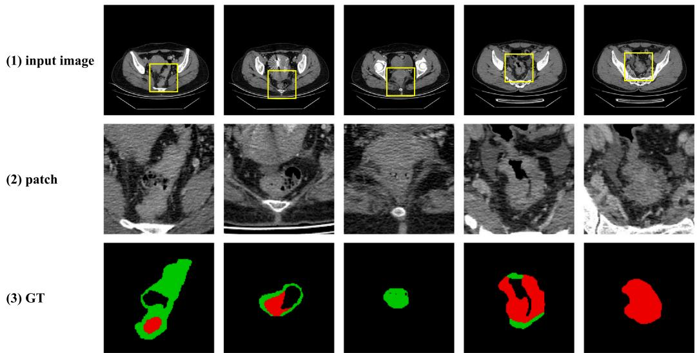  
Fig. 1. Examples of rectal cancer CT images on CARE dataset. (2) is the zoomed-in patch of (1), while (3) is the ground truth (GT) of (2). The red region represents the normal rectum, and the green region represents the rectal tumor.

To overcome the above challenges, this paper proposes GLocalSeg, a global–local collaborative segmentation framework that introduces architecturally distinct innovations beyond existing CNNs–Transformer hybrids. Unlike prior methods that merely concatenate or linearly fuse CNNs and Transformer features, GLocalSeg enables deep, structureaware cross-modal interaction through three key technical designs: (1) a Hybrid Attention CNNs encoder tailored for low-contrast rectal CT images, which enhances boundary-relevant local representations via the proposed CSDA module; (2) a Vision Transformer (ViT) encoder equipped with a MultiScaleHead to convert long-range global semantics into spatially aligned multi-scale feature maps; and (3) a HybridFusion-CDG module that fuses local and global features. These architectural innovations directly mitigate over-segmentation and under-segmentation: the edge-guided component sharpens weak or blurred boundaries, the semantic-difference modeling detects and corrects local–global inconsistencies, and the bidirectional gating adaptively balances global semantics with fine-grained structural cues, preventing ViT from oversmoothing and CNNs from missing subtle tumor regions. These components are integrated with a multi-level decoder to form GLocalSeg as a fully end-to-end segmentation network.

The main contributions of this paper are as follows:

• A parallel architecture combining a Hybrid attention CNNs encoder and a ViT encoder is proposed to jointly extract fine-grained local details and global context.

• We design a HybridFusionCDG module that incorporates edgeguided enhancement, semantic-difference modeling, and gated bidirectional feature interaction. This module enables deeper coordination between local details and global context and helps mitigate common over-segmentation and under-segmentation issues in rectal tumor delineation.

• We demonstrate that our proposed method performs competitively against state-of-the-art approaches on two public datasets. On the CARE dataset, our method achieves 67.27% Mean Dice, 51.95% Mean IoU, 11.38 mm Mean HD95, and 3.55 mm Mean ASD. On the TeddyCup dataset, it attains Dice, IoU, HD95, and ASD scores of 67.00%, 51.69%, 8.78 mm, and 2.34 mm, respectively.

The rest of this paper is organized as follows: Section 2 reviews related deep learning-based segmentation methods. Section 3 presents the overall architecture and key components of our proposed GLocalSeg method. Section 4 describes the experimental setup and evaluation metrics. Then, Section 5 reports and analyzes the results of ablation studies and comparative experiments. Discussion and Conclusion are given in Section 6 and Section 7, respectively.

## 2. Related work

## 2.1. Image segmentation based on CNNs

With the rapid advancement of deep learning, convolutional neural networks (CNNs) have demonstrated outstanding performance in medical image segmentation and have become the mainstream method in this field. Trebeschi et al. [17] were among the first to apply a CNNs-based classification network to multiparametric MRI, where local features were learned to generate probability maps, followed by thresholding and largest connected component selection to achieve automatic rectal tumor segmentation. Zhang et al. [18] proposed the 3D V-Net, which employed a coarse-to-fine cascade strategy: a lowresolution method was used for coarse tumor localization, followed by a high-resolution method for sub-millimeter level refinement. UNet [10], as an end-to-end segmentation method, achieved notable performance in medical image segmentation. Since then, numerous UNet variants have been proposed to improve performance. For example, Zhang et al. [19] incorporated attention mechanisms into UNet to enhance focus on key regions, improving the segmentation accuracy of rectal cancer MRI. Zhang et al. [20] used multiscale densely connected convolutional neural network based on attention mechanism to automatically segment rectal tumors from MRI. Li et al. [21] achieved rectal tumor segmentation by improving CycleGAN and U-Net methods. Inspired by U-Net, Meng et al. [22] proposed a novel segmentation network, MSBC-Net, for automatic localization and segmentation of rectal cancer and the rectal wall. Li et al. [23] proposed a contour-predictionbased UNet variant that enhanced both feature extraction and contour representation, effectively improving tumor boundary segmentation. Jha et al. [11] proposed ResUNet++, which integrates residual connections and multi-level attention to improve gradient flow and enhance feature representation of target regions. Ibtehaz et al. [24] proposed MultiResUNet, which utilizes multi-resolution convolutional modules to strengthen feature representation across different scales, further improving segmentation of complex anatomical structures.

Although CNNs-based methods have achieved widespread success in medical image segmentation, their performance remains limited in complex scenarios. Medical segmentation tasks often require accurate understanding of global semantic context to precisely delineate lesion regions. However, CNNs-based methods, due to their inherently limited receptive fields, struggle to capture long-range dependencies among distant pixels, leading to performance degradation when handling objects with irregular shapes, complex structures, or blurred boundaries.

## 2.2. Image Segmentation Based on Transformer

Since the introduction of a transformer into computer vision, a surge of related research and applications has emerged. In the field of image segmentation, transformer-based semantic segmentation methods such as SETR [12] have been proposed. Huang et al. [13] proposed MissFormer, a medical image segmentation method based purely on the transformer architecture, which replaces traditional convolution operations with self-attention mechanisms and a global–local context fusion strategy. Cao et al. [25] proposed SwinUNet, a pure transformer U-shaped network based on Swin Transformer, employing an encoder–decoder architecture with skip connections to perform medical image segmentation. Furthermore, recent advances in semi-supervised learning, such as the WB-SGAN framework for imbalanced skin lesion diagnosis [26] and the wavelet-transformer discriminator for robust pseudo-labeling [27], also demonstrate the potential of transformerbased methods in handling medical image data.

Although pure Transformer architectures can effectively model long-range dependencies in medical images through global selfattention mechanisms, they tend to lack sufficient focus on local finegrained lesions, leading to potential detail loss. To balance the preservation of local details with global context modeling, Chen et al. [28] proposed TransUNet, which cascades CNNs with a Transformer encoder to deeply fuse local features and global semantics. Wang et al. [29] proposed UCTransNet, which designs the CTrans module to replace the skip connections of UNet, leveraging channel-wise Transformer mechanisms to bridge the semantic gap between the encoder and decoder. Furthermore, Zhang et al. [30] proposed Dual Parallel Net (DuPNet), a dual-parallel encoder method that integrates CNNs and Transformer architectures, and innovatively incorporates a Gaussian mixture prior mechanism to achieve accurate segmentation of rectal tumors in MRI, offering a new perspective on the integration of CNNs and transformer. Sang et al. [31] proposed FCTformer, which integrates transformer-based global and CNNs-based local feature extraction to achieve accurate rectal tumor segmentation in 3D MRI.

Comparison with Existing CNNs–Transformer Hybrid Methods. Existing CNNs–Transformer hybrid methods such as TransUNet [28], UCTransNet [29], FCTformer [31], and DUPNet [30] all aim to combine local CNNs features with global Transformer representations, but their fusion mechanisms remain relatively shallow. TransUNet performs sequential CNNs-to-Transformer encoding, UCTransNet improves channel-wise skip connections, and FCTformer focuses on 3D multiscale fusion for MRI, while DUPNet introduces shape priors into the Transformer pathway. However, these methods generally lack explicit modeling of boundary cues, semantic discrepancies, and cross-modal consistency, which limits their performance on low-contrast CT images. In contrast, GLocalSeg employs a dual parallel encoder design together with the HybridFusionCDG module, enabling edge-guided enhancement, semantic-difference modeling, and gated bidirectional fusion. This leads to deeper global–local collaboration and more robust boundary recovery than existing hybrid architectures.

## 2.3. Image segmentation based on SAM

In recent years, generalist segmentation methods, represented by Meta’s Segment Anything Model (SAM) [32], have demonstrated groundbreaking potential. To address the specific characteristics of medical imaging, several works have proposed modifications to the SAM architecture. MedSAM [15] fine-tunes SAM’s encoder and introduces medical image-specific feature enhancement modules, thereby improving sensitivity to small structures in multi-organ abdominal segmentation tasks. U-SAM [33] builds on SAM’s promptable segmentation paradigm by introducing a U-shaped adapter with skip connections to fuse multi-scale features, enhancing rectal and tumor boundary segmentation. Additionally, SAM-Med2D [34] injects medical prior knowledge to further enhance multi-class segmentation performance. These methods demonstrate that, through domain-specific adaptations, SAM can achieve segmentation accuracy comparable to specialized methods in certain medical tasks, while significantly reducing the need for annotated data.

However, existing SAM-based medical segmentation methods still exhibit a reliance on manual interactions. While SAM excels at interactive segmentation, clinical applications demand more fully automatic segmentation solutions.

## 3. Methodology

Our proposed method follows a U-shaped encoder–decoder architecture which consists of four key components, as shown in Fig. 2, including a dual-parallel encoder built upon a Hybrid Attention CNNs encoder and a ViT encoder, a MultiScaleHead for multi-level global feature projection, a HybridFusionCDG module for cross-scale feature integration, and a segmentation decoder. The details of our proposed components are in the following subsections.

## 3.1. Dual-parallel encoder

One of the main challenges in rectal cancer segmentation is the complex and variable morphology of tumors, as well as the low contrast between normal rectum, rectal tumors, and surrounding healthy tissues in CT images. These problems make it difficult for a single feature extraction method to simultaneously capture global contextual information and local detailed features. Therefore, we propose a dual-parallel encoder that combines a Hybrid Attention CNNs encoder and a ViT encoder, aiming to fully leverage the complementary strengths of both components and thereby improve segmentation accuracy.

## 3.1.1. ViT encoder

To introduce global contextual modeling into the segmentation framework, we adopt a ViT encoder from the Segment Anything Model (SAM) [32]. The overall architecture of the ViT encoder is shown in Fig. 3. Given an input image

$$
I \in \mathbb { R } ^ { 3 \times 2 2 4 \times 2 2 4 } ,\tag{1}
$$

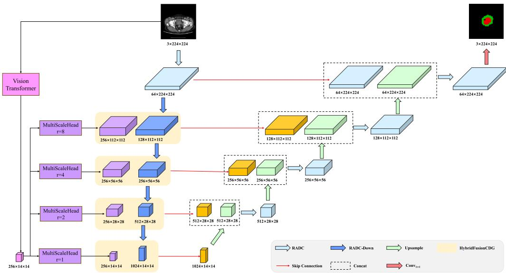  
Fig. 2. An overview of the proposed GLocalSeg framework. A dual-parallel encoder is constructed by combining a Hybrid Attention CNNs encoder with a ViT encoder, enabling the extraction of complementary local detailed features and global contextual information. The ViT features are further processed by the MultiScaleHead, which converts the $1 4 \times 1 4$ token embeddings into multi-scale feature maps aligned with the spatial resolutions of the CNNs encoder. At each level, the features from the Hybrid Attention CNNs encoder and ViT encoder are fused through the HybridFusionCDG module. The decoder progressively restores spatial resolution via upsampling and skip connections, ultimately producing precise segmentation maps for the rectum and tumor regions.

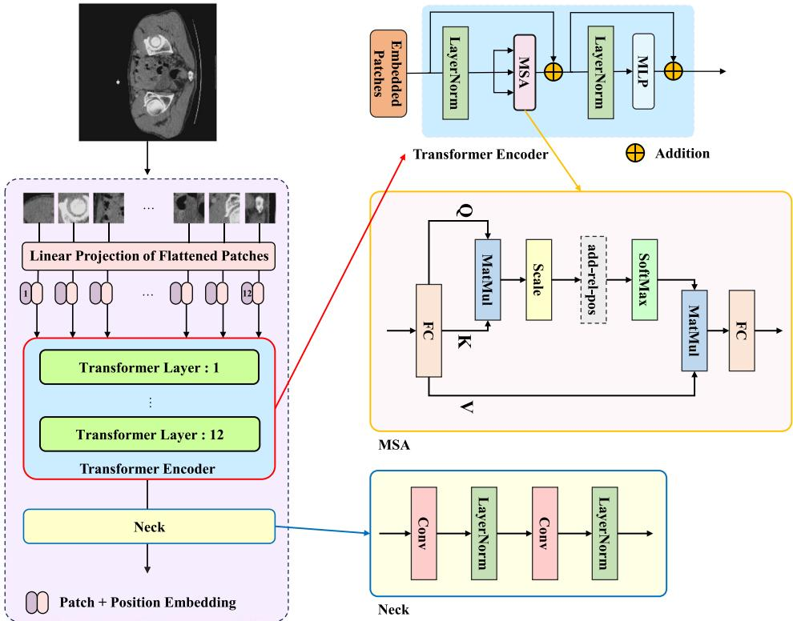  
Fig. 3. An overview of ViT encoder.

the encoder begins by uniformly partitioning the image into nonoverlapping $1 6 \times 1 6$ patches. This yields

$$
N = \left( { \frac { 2 2 4 } { 1 6 } } \right) ^ { 2 } = 1 9 6\tag{2}
$$

visual tokens. Each patch $\boldsymbol { x } _ { p } \in \mathbb { R } ^ { 1 6 \times 1 6 \times 3 }$ is flattened and then projected into $\textbf { a } D = 7 6 8$ dimensional embedding through a learnable linear

projection

$$
z _ { p } = W _ { e } x _ { p } ^ { \mathrm { f l a t } } + b _ { e } , \quad W _ { e } \in \mathbb { R } ^ { ( 1 6 ^ { 2 } \times 3 ) \times 7 6 8 } .\tag{3}
$$

Since the transformer is permutation-invariant, we inject spatial information by adding learnable positional embeddings:

$$
Z _ { 0 } = [ z _ { 1 } ; z _ { 2 } ; \ldots ; z _ { 1 9 6 } ] + E _ { \mathrm { p o s } } , \quad E _ { \mathrm { p o s } } \in \mathbb { R } ^ { 1 9 6 \times 7 6 8 } .\tag{4}
$$

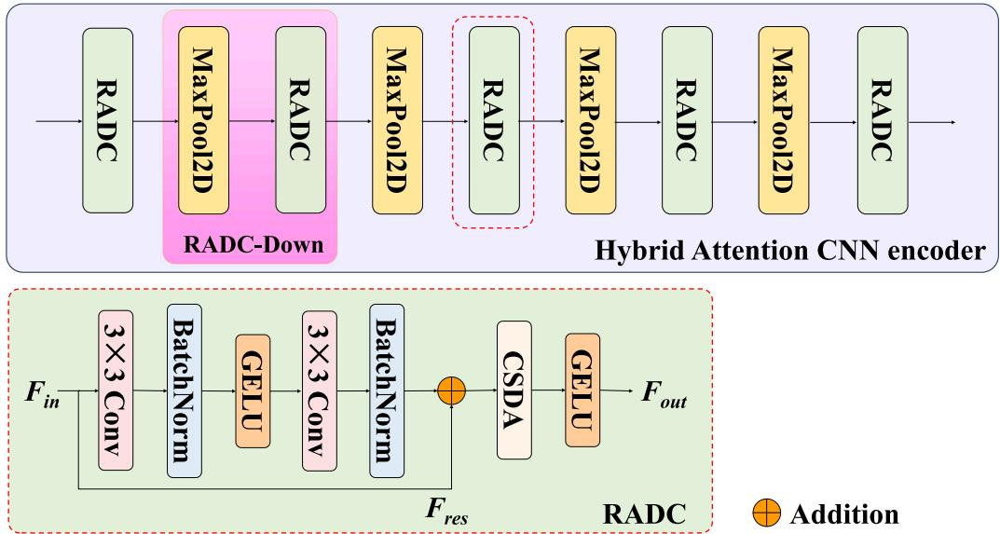  
Fig. 4. An overview of Hybrid Attention CNNs encoder.

The sequence $Z _ { 0 }$ is then processed by a 12 layer transformer encoder, where each layer consists of Multi-Head Self-Attention (MSA) and a multilayer perceptron (MLP), both with residual connections and layer normalization. For layer ??, the computations follow

$$
\begin{array} { r l } & { Z _ { l } ^ { \prime } = \mathrm { M S A } ( \mathrm { L N } ( Z _ { l } ) ) + Z _ { l } , } \\ & { Z _ { l + 1 } = \mathrm { M L P } ( \mathrm { L N } ( Z _ { l } ^ { \prime } ) ) + Z _ { l } ^ { \prime } . } \end{array}\tag{5}
$$

Within each self-attention module, the attention weights are obtained through

$$
{ \mathrm { A t t e n t i o n } } ( Q , K , V ) = { \mathrm { s o f t m a x } } \left( { \frac { Q K ^ { T } } { \sqrt { d _ { k } } } } \right) V ,\tag{6}
$$

where ??, ??, and ?? are linear projections of $Z _ { l }$ and $d _ { k }$ is the head dimension. Following SAM, we apply global attention at the 3rd, 6th, 9th, and 12th layers, enabling each token to attend to all others without windowing constraints. This enhances the encoder’s ability to model long-range anatomical dependencies and global structural relationships—properties critical for medical image segmentation. To obtain spatially interpretable features, the output tokens from each transformer layer are reshaped back to a 2D grid and further processed by convolutional Neck, which reduces the channel dimension from 768 to 256. This produces feature maps

$$
F _ { l } \in \mathbb { R } ^ { 2 5 6 \times 1 4 \times 1 4 } .\tag{7}
$$

From the entire transformer stack, we extract multi-level features from 3rd, 6th, 9th, and 12th layers, corresponding to increasingly abstract contextual representations. Shallow layers capture fine texture patterns, intermediate layers encode organ-level structures, and deeper layers integrate global context through repeated global attention. These hierarchical ViT features provide rich complementary information to the Hybrid Attention CNNs encoder and are fused in the HybridFusionCDG module to generate accurate and anatomically consistent segmentation predictions.

## 3.1.2. Hybrid attention CNNs encoder

The Hybrid Attention CNNs encoder is designed to extract local detailed features by leveraging convolutional operations and attention mechanisms. It captures spatially localized patterns such as textures, boundaries, and structural details, which complement the global contextual information provided by the ViT encoder. This encoder consists of a Residual Attention Double Convolution (RADC) block and a hierarchical downsampling (RADC-Down) block.

This encoder contains five hierarchical stages. As shown in Fig. 4, it begins with an initial RADC block that preserves spatial resolution, followed by four progressively downsampled stages, each implemented using an RADC-Down block.

The RADC block extends the classical DoubleConv design by integrating residual learning and the CSDA module. Given an input feature map Fin, two successive 3 × 3 convolutions extract deeper local representations, while a residual shortcut stabilizes optimization and facilitates gradient propagation. The CSDA module refines intermediate features through parallel channel and spatial attention, enabling the block to selectively emphasize clinically relevant structures and suppress irrelevant responses. A GELU activation is applied at the block output to introduce smooth nonlinearity.

Formally, the RADC block can be expressed as

$$
F _ { o u t } ~ = ~ \mathrm { G E L U } \big ( \mathrm { C S D A } \big ( \mathrm { C o n v } _ { 3 \times 3 } \big ( \mathrm { C o n v } _ { 3 \times 3 } ( F _ { i n } ) \big ) + F _ { r e s } \big ) \big ) ,\tag{8}
$$

where $F _ { r e s }$ denote the residual connection, $\mathrm { C o n v } _ { 3 \times 3 } ( \cdot )$ denotes a $3 \times 3$ convolution, and GELU(⋅) is the Gaussian Error Linear Unit activation.

Each encoder stage (except the first full-resolution stage) applies the RADC-Down block to progressively reduce spatial resolution while enriching semantic content. The RADC-Down blcok performs a $2 \times 2$ max-pooling followed by an RADC block:

$$
F _ { l + 1 } = \mathrm { \mathrm { R A D C } } ( \mathrm { M a x P o o l } _ { 2 \times 2 } ( F _ { l } ) ) ,\tag{9}
$$

where $F _ { l }$ and $F _ { l + 1 }$ denote the input and output feature maps of the ??th stage, respectively. Repeating this operation across stages yields a multi-scale feature hierarchy $\{ F _ { 1 } , F _ { 2 } , \dots , F _ { 5 } \}$ . These multi-resolution CNNs features are subsequently fused with the ViT-derived multi-level tokens via the HybridFusionCDG module, thereby combining local detailed features with long-range contextual information.

## 3.2. CSDA module

CSDA (Channel-Spatial Dual Attention) module is incorporated into the Hybrid Attention CNNs encoder and the upsampling stages following its fusion with the ViT encoder, aiming to enhance the representation of local detailed features and global contextual information. Unlike sequential attention mechanisms, in Fig. 5, CSDA module computes channel and spatial attention in parallel. Given a feature map ?? ∈ R??×??×??×?? , the channel branch extracts global descriptors via adaptive average and max pooling and applies a two-layer transformation ??(⋅) to produce

$$
M _ { c } = \sigma ( \Phi ( \operatorname { A v g P o o l } ( X ) ) + \phi ( \operatorname { M a x P o o l } ( X ) ) ) .\tag{10}
$$

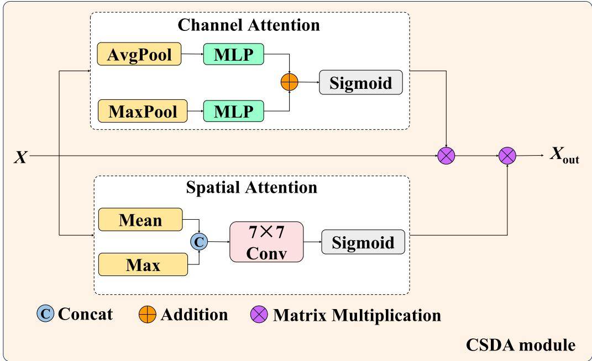  
Fig. 5. An overview of CSDA module.

Simultaneously, the spatial branch aggregates channel responses using mean and max projection, concatenates them, and then processes the result with a $7 \times 7$ convolution $\mathrm { C o n v } _ { 7 \times 7 } ( \cdot )$ to generate

$$
M _ { s } = \sigma \left( \operatorname { C o n v } _ { 7 \times 7 } ( [ \operatorname { M e a n } ( X ) ; \operatorname { M a x } ( X ) ] ) \right) .\tag{11}
$$

The final refined feature $X _ { \mathrm { o u t } }$ is obtained by parallel fusion of the two attention maps:

$$
X _ { \mathrm { o u t } } = M _ { c } \otimes M _ { s } \otimes X .\tag{12}
$$

## 3.3. MultiScaleHead and HybridFusionCDG module

We extract multi-scale global features from the 3rd, 6th, 9th, and 12th layers of the ViT encoder and efficiently upsample them to resolutions fully aligned with the Hybrid Attention CNNs encoder using a MultiScaleHead module. The resulting features are then fused with the CNNs features via the HybridFusionCDG module, enabling precise coordination between local detailed features and global contextual information, which enhances boundary accuracy and overall anatomical consistency.

## 3.3.1. MultiScaleHead module

Since the ViT encoder outputs fixed, low-resolution feature maps, we introduce the MultiScaleHead module to achieve precise alignment with the CNNs encoder at each level. This module contains four parallel branches corresponding to upsampling factors $r ~ \in ~ \{ 8 , 4 , 2 , 1 \}$ }. For $r \ = \ 1 _ { . }$ , the deepest layer features undergo only $\textbf { a } 1 \times 1$ convolution followed by GELU activation for channel mapping, without altering spatial resolution. For $r \in \{ 2 , 4 , 8 \}$ , the feature channels are first expanded to $2 5 6 \times r ^ { 2 }$ via $\textbf { a } 1 \times 1$ convolution, and then upsampled by a factor of ?? using the PixelShuffle layer, producing high-resolution feature maps precisely aligned with UNet layers 2 through 5. This design effectively avoids checkerboard artifacts common in transposed convolutions, while preserving feature quality and spatial continuity during upsampling. After alignment through the MultiScaleHead, the ViT global contextual information and CNNs local detailed features are spatially matched and subsequently input to the HybridFusionCDG module for deep collaborative fusion, enabling effective integration of global contextual information with local detailed features.

## 3.3.2. HybridFusionCDG module

Accurate segmentation of rectal tumors in CT scans is challenged by fuzzy boundaries, low contrast, and heterogeneous intra-tumoral textures. Existing CNNs–ViT fusion strategies typically rely on simple concatenation or linear weighting, which is insufficient for capturing the complementary nature of local detailed features and global contextual information . To address this limitation, we propose the HybridFusionCDG (Edge-guided C, Semantic-difference D, and Gated Cross Semantic Fusion G) module in Fig. 6.

Edge-guided structural enhancement (C). In medical CT images, the boundary between the rectum and tumors often appears faint, fragmented, or even submerged in noise. Therefore, we first extract structural gradients from the CNNs feature map ??:

$$
E = { \mathrm { S o b e l } } ( U ) ,\tag{13}
$$

where ?? denotes the Sobel gradient magnitude, which corresponds to regions with the most significant tissue density variations. A convolutional mapping $f _ { c } ( \cdot )$ is then applied to obtain an edge-guided attention mask:

$$
M _ { c } = \sigma ( f _ { c } ( { \cal E } ) ) ,\tag{14}
$$

where $\sigma ( \cdot )$ is the Sigmoid function, used to map the gradient information into the $^ { ( 0 , 1 ) }$ range to form structural attention weights. To inject local detailed features into the ViT semantic space, the feature map ?? is first projected ??′ via a ${ \bf 1 } \times { \bf 1 }$ convolution and then refined through edge-guided modulation:

$$
\tilde { S } = S ^ { \prime } \cdot ( 1 + M _ { c } ) ,\tag{15}
$$

where ??̃ represents the semantic feature enriched with reliable edge priors, enabling global semantics to respond more strongly in blurred boundary regions and providing sharper structural cues for subsequent segmentation refinement.

Semantic-difference modeling (D). Due to fundamentally different modeling paradigms, CNNs and ViT features often diverge in regions with complex tumor textures. To explicitly capture this mismatch, we compute:

$$
\begin{array} { r } { D = S ^ { \prime } - U ^ { \prime } , } \end{array}\tag{16}
$$

Here, ?? denotes the discrepancy between semantic-level representations and local detailed features at corresponding spatial positions,

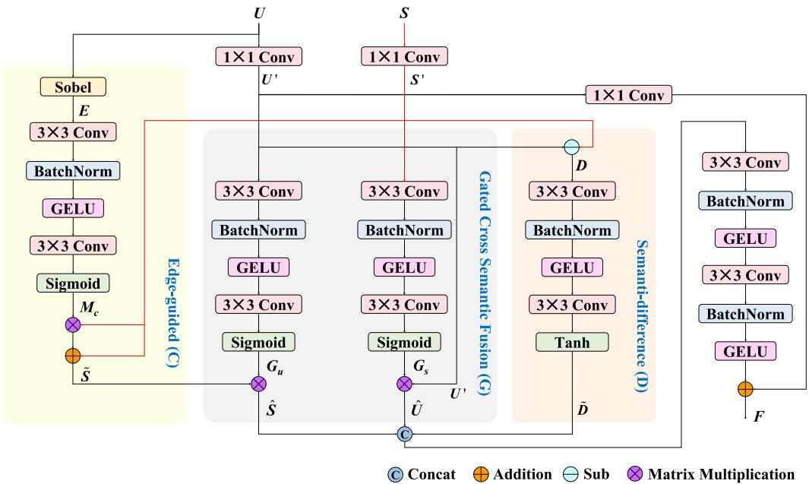  
Fig. 6. An overview of HybridFusionCDG module.

where $S ^ { \prime }$ and $U ^ { \prime }$ refer to the ViT and CNNs feature maps after a $1 \times 1$ convolutional projection, respectively. To further emphasize these differences, we introduce a nonlinear mapping $f _ { d } ( \cdot ) \colon$

$$
\tilde { D } = \operatorname { t a n h } ( f _ { d } ( D ) ) ,\tag{17}
$$

where the bounded and symmetric nature of tanh(⋅) helps highlight high-confidence difference regions while suppressing noise, enabling the method to focus more effectively on true ambiguous or transitional boundaries.

Semantic-difference modeling (D). To prevent mutual interference between the two feature domains during fusion, we introduce a bidirectional gating strategy. This allows the CNNs feature to absorb the global semantic information from the ViT, while the ViT feature can focus on the structural details provided by the CNNs. Specifically, we learn two gating weights:

$$
G _ { s } = \sigma ( f _ { s } ( S ^ { \prime } ) ) , \quad G _ { u } = \sigma ( f _ { u } ( U ^ { \prime } ) ) ,\tag{18}
$$

where $G _ { s }$ is the gate extracted from the ViT semantic space, used to modulate the degree to which the CNNs attends to global contextual information; $G _ { u }$ is extracted from local CNNs detailed features and guides the ViT to emphasize structure-enhanced regions. Finally, we obtain the gated features:

$$
\hat { U } = U ^ { \prime } \cdot G _ { s } , \quad \hat { S } = \tilde { S } \cdot G _ { u } .\tag{19}
$$

After obtaining the structure-enhanced semantic feature ${ \hat { S } } ,$ the gated structural feature ${ \hat { U } } ,$ and the semantic difference $\hat { D } ,$ we concatenate them and pass them through a multi-layer convolutional fusion module $f _ { f u s e } ( \cdot ) \colon$

$$
F = f _ { \mathrm { f u s e } } \big [ \hat { U } \parallel \hat { S } \parallel \tilde { D } \big ] + f _ { \mathrm { r e s } } ( U ^ { \prime } ) ,\tag{20}
$$

where the residual term $f _ { r e s } ( U ^ { \prime } )$ preserves the stable structural priors from the mainstream CNNs pathway, preventing feature drift or gradient imbalance during fusion.

Through this design, HybridFusionCDG can fully exploit both the edge sensitivity of CNNs and the globally consistent semantic reasoning of ViT. This enables the network to produce significantly improved boundary completeness and geometric accuracy in challenging scenarios where tumor boundaries are blurred or tissue contrast is insufficient.

## 3.4. Decoder

In the decoding stage, the network adopts a hierarchical reconstruction pathway composed of four progressively upsampling modules, symmetrically aligned with the encoder. Each upsampling module first performs bilinear upsampling on the high-level semantic features, followed by a 3 × 3 convolution and normalization block to consolidate local detailed features. The upsampled representation is then aligned and concatenated with the corresponding encoder features, which have been pre-processed by the HybridFusionCDG module. After concatenation, a RADC block further refines the fused features. The decoder progressively restores spatial detail while preserving semantic consistency across scales.

Finally, the reconstructed high-resolution feature map is passed through a ${ \bf 1 } \times { \bf 1 }$ convolution layer to project the multi-channel representation into the target semantic space, yielding the final segmentation mask with the desired number of output classes.

## 3.5. Loss function

The segmentation task in this study is characterized by significant class imbalance, where the background pixels vastly outnumber the small foreground regions. To effectively address this challenge, we utilize a final loss function composed of the standard Cross-Entropy (CE) loss and the Dice loss, combined via a weighted sum.

## 3.5.1. Cross-entropy loss

The CE loss is widely used in multi-class segmentation tasks, as it optimizes the method to predict the correct class probability for each pixel. It is defined as:

$$
L _ { C E } ( P , T ) = - \frac { 1 } { N } \sum _ { i = 1 } ^ { N } \sum _ { c = 0 } ^ { C - 1 } T _ { i , c } \log ( P _ { i , c } )\tag{21}
$$

where ?? is the total number of pixels, ?? is the number of classes, $T _ { i , c }$ is the ground truth, and $P _ { i , c }$ is the predicted probability for pixel ?? belonging to class $c _ { \bullet }$ However, in highly imbalanced datasets, the $L _ { C E }$ is dominated by the easily classified background pixels, leading to suboptimal focus on the small foreground regions.

## 3.5.2. Dice loss

The Dice loss is derived directly from the Dice similarity coefficient (DSC), a metric that measures the overlap between two sets. It is particularly effective for medical image segmentation and other tasks with severe class imbalance because it focuses on the co-occurrence of predicted and ground truth labels. This makes it crucial for accurately segmenting the typically small and critical regions, such as the rectal tumor, by being less sensitive to the large volume of true negatives (background). The standard Dice coefficient for a class ?? is:

$$
\mathrm { D S C } _ { c } = \frac { 2 \sum _ { i } P _ { i , c } T _ { i , c } } { \sum _ { i } P _ { i , c } + \sum _ { i } T _ { i , c } }\tag{22}
$$

The Dice loss is then defined as $L _ { D i c e , c } = 1 - \mathrm { D S C } _ { c }$ . To ensure computational stability and general robustness, the final Dice loss is typically averaged over all classes:

$$
L _ { D i c e } ( P , T ) = \frac { 1 } { C } \sum _ { c = 0 } ^ { C - 1 } ( 1 - \mathrm { D S C } _ { c } )\tag{23}
$$

## 3.5.3. Final loss

The combined loss function, ??, is employed to harness the complementary strengths of both components: the pixel-wise stability and strong gradients of $L _ { C E } ,$ and the ability of $L _ { D i c e }$ to handle class imbalance and directly optimize the primary segmentation metric. The final loss is formulated as a weighted sum:

$$
L = ( 1 - \lambda ) L _ { C E } ( P , T ) + \lambda L _ { D i c e } ( P , T )\tag{24}
$$

In this study, the weights are empirically set to prioritize the metricbased Dice loss due to the high class imbalance. With $\lambda = 0 . 6$ , the final loss function is $L = 0 . 4 L _ { C E } + 0 . 6 L _ { D i c e } .$

## 4. Experiments

In this section, we evaluate our GLocalSeg on two public segmentation datasets: CARE [33] and TeddyCup. To show the effectiveness of our GLocalSeg, we compare it with other state-of-the-art methods and conduct ablation studies.

## 4.1. Dataset

## 4.1.1. CARE

This dataset is obtained from the publicly available rectal cancer segmentation dataset called CARE [33], provided by the First Affiliated Hospital of Anhui Medical University. It contains 399 rectal cancer patients with a total of 33,117 pairs of CT image slices. All images are portal venous phase contrast-enhanced abdominal CT scans acquired using abdominal window settings, with a resolution of 512 × 512. The dataset includes cases with a wide range of pathological stages, tumor sizes, and morphological characteristics. Each case underwent pixel-level annotation, including both normal rectal tissue and tumor regions.

CARE dataset was split patient-wise into training/validation/test sets with a 7:1:2 ratio (to ensure that no slices from the same patient appear in different sets). Specifically, the split contains 278 patients (23,105 slices) for training, 40 patients (3551 slices) for validation, and 81 patients (6461 slices) for testing.

## 4.1.2. TeddyCup

TeddyCup dataset is obtained from Task B of the 7th ‘‘Teddy Cup’’ Data Mining Competition: Intelligent Diagnosis of Lymph Node Metastasis in Rectal Cancer. It consists of CT scans from 107 patients diagnosed with rectal cancer, accompanied by physician-annotated masks that delineate only the rectal tumor regions. Normal rectal tissues are not annotated in this dataset. A total of 3032 axial CT slices were collected, each with a resolution of 512 × 512 pixels. Among them, 860 slices contain visible rectal tumors, while the remaining 2172 slices contain only background without any tumor regions. The dataset is split into training, validation, and test sets in a 7:1:2 ratio at the patient level. Specifically, the split contains 74 patients (2086 slices) for training, 11 patients (291 slices) for validation, and 22 patients (652 slices) for testing.

Table 1  
Main training parameter settings.
<table><tr><td>Parameter</td><td>Value</td></tr><tr><td>GPU</td><td>RTX 4090 (24 GB)</td></tr><tr><td>Framework</td><td>PyTorch</td></tr><tr><td>Input resolution</td><td>224 × 224</td></tr><tr><td>Batch size</td><td>16</td></tr><tr><td>Epochs</td><td>100</td></tr><tr><td>Optimizer</td><td>AdamW</td></tr><tr><td>Base learning rate (non-ViT)</td><td> $3 \times 1 0 ^ { - 4 }$ </td></tr><tr><td>Learning rate (ViT encoder)</td><td> $3 \times 1 0 ^ { - 5 }$ </td></tr></table>

## 4.2. Implementation details

## 4.2.1. Data preprocessing

To reduce overfitting, we applied data augmentation only during training. Specifically, we used two types of augmentations: random rotations in 90◦ increments (0◦, 90◦, 180◦, or 270◦) combined with horizontal or vertical flipping, and random in-plane rotations within –20◦ to 20◦. All datasets were normalized to a 0–1 range before training.

## 4.2.2. Experiment settings

All experiments were implemented in PyTorch and trained on a single NVIDIA RTX 4090 GPU. To accelerate training, all input images were resized to 224 × 224, and the main training parameters are summarized in Table 1. A linear warm-up was applied during the first five epochs, followed by a cosine annealing strategy. The ViT encoder was initialized with SAM-ViT-B pretrained weights, while the remaining parameters were randomly initialized.

## 4.3. Evaluation metrics

To comprehensively assess segmentation performance, we adopt four commonly used evaluation metrics in medical image analysis: the Dice similarity coefficient score (Dice), Intersection over Union (IoU), the 95th percentile Hausdorff Distance (HD95), and the Average Surface Distance (ASD). For all metrics, we compute the scores for the normal rectum and rectal tumor classes separately, followed by reporting their mean values.

Dice. The Dice coefficient quantifies the spatial overlap between the predicted region $P _ { c }$ and the ground truth $T _ { c } .$ It ranges from 0 to 1, with higher values indicating better agreement. The Dice score is defined as:

$$
\mathrm { D i c e } _ { c } = \frac { 2 | P _ { c } \cap T _ { c } | } { | P _ { c } | + | T _ { c } | } = \frac { 2 T P _ { c } } { 2 T P _ { c } + F P _ { c } + F N _ { c } } .\tag{25}
$$

We additionally report the Mean Dice, computed as the average Dice score across the normal rectum and tumor classes.

IoU. IoU measures the ratio between the intersection and union of prediction and ground truth:

$$
\mathrm { I o U } _ { c } = \frac { | P _ { c } \cap T _ { c } | } { | P _ { c } \cup T _ { c } | } = \frac { T P _ { c } } { T P _ { c } + F P _ { c } + F N _ { c } } .\tag{26}
$$

The Mean IoU is obtained by averaging the IoU values of the two foreground classes.

HD95. Boundary accuracy is further evaluated using the 95th percentile Hausdorff Distance (HD95), which measures the largest surfaceto-surface deviation while reducing sensitivity to outlier points. Lower HD95 values indicate more precise boundary localization.

ASD. ASD computes the mean symmetric surface distance between prediction and ground truth, providing a stable measurement of overall contour similarity. As with HD95, smaller ASD values correspond to better segmentation quality.

Comparison results of different segmentation methods on CARE dataset. The best results are highlighted in bold. \*, \*\*, and \*\*\* indicate statistical significance levels of p < 0.05, p < 0.01, and p < 0.001 (Wilcoxon signed-rank test), respectively.
<table><tr><td rowspan="2">Methods</td><td colspan="4">Normal</td><td colspan="4">Tumor</td><td colspan="4">Mean</td></tr><tr><td>Dice (%)</td><td>IoU (%)</td><td>HD95 (mm)</td><td>ASD (mm)</td><td>Dice (%)</td><td>IoU (%)</td><td>HD95 (mm)</td><td>ASD (mm)</td><td>Dice (%)</td><td>IoU (%)</td><td>HD95 (mm)</td><td>ASD (mm)</td></tr><tr><td>UNet [10]</td><td>60.30</td><td>44.09</td><td>13.6735</td><td>3.8976</td><td>66.62</td><td>51.85</td><td>17.9694</td><td>5.8817</td><td>63.46</td><td>47.97</td><td>15.8214</td><td>4.8897</td></tr><tr><td>Unet+++ [35]</td><td>62.54</td><td>46.39</td><td>12.2347</td><td>3.6208</td><td>68.84</td><td>54.21</td><td>16.9938</td><td>5.7731</td><td>65.69</td><td>50.30</td><td>14.6142</td><td>4.6970</td></tr><tr><td>AttenUNet [36]</td><td>62.44</td><td>46.20</td><td>10.9292</td><td>2.3434</td><td>67.93</td><td>53.37</td><td>15.1684</td><td>4.9962</td><td>65.18</td><td>49.79</td><td>13.0488</td><td>4.1698</td></tr><tr><td>ResUNet++ [11]</td><td>59.86</td><td>43.93</td><td>15.2221</td><td>4.4477</td><td>66.51</td><td>52.02</td><td>16.4461</td><td>5.4024</td><td>63.18</td><td>47.98</td><td>15.8341</td><td>4.9251</td></tr><tr><td>MISSFormer [13]</td><td>59.87</td><td>43.63</td><td>11.8748</td><td>3.3695</td><td>65.79</td><td>51.11</td><td>16.7739</td><td>5.6152</td><td>62.83</td><td>47.37</td><td>14.3244</td><td>4.4923</td></tr><tr><td>MultiResUNet [24]</td><td>56.73</td><td>40.59</td><td>11.2092</td><td>3.9498</td><td>64.55</td><td>49.98</td><td>18.7805</td><td>6.1644</td><td>60.64</td><td>45.08</td><td>14.9949</td><td>5.0571</td></tr><tr><td>SwinUNet [25]</td><td>56.08</td><td>39.89</td><td>12.7621</td><td>3.6421</td><td>65.91</td><td>50.84</td><td>15.1460</td><td>4.9574</td><td>60.99</td><td>45.36</td><td>13.9541</td><td>4.2998</td></tr><tr><td>TransUNet [28]</td><td>50.09</td><td>34.23</td><td>11.1183</td><td>3.1215</td><td>63.78</td><td>48.57</td><td>14.9132</td><td>4.8685</td><td>56.93</td><td>41.40</td><td>13.0247</td><td>3.9950</td></tr><tr><td>UCTransNet [29]</td><td>59.89</td><td>43.60</td><td>12.0299</td><td>3.4676</td><td>70.22</td><td>55.60</td><td>16.4448</td><td>5.5184</td><td>65.05</td><td>49.60</td><td>14.2374</td><td>4.4930</td></tr><tr><td>nnUNet [37]</td><td>56.08 64.44***</td><td>39.84 48.38***</td><td>14.5721 8.7488***</td><td>3.9145</td><td>64.56</td><td>49.77 55.51***</td><td>21.6118</td><td>6.4060</td><td>60.32 67.27***</td><td>44.80 51.95***</td><td>18.0919 11.3775***</td><td>5.1602</td></tr><tr><td>GLocalSeg (ours)</td><td></td><td></td><td></td><td>2.6716***</td><td>70.09***</td><td></td><td>14.0061***</td><td>4.4322**</td><td></td><td></td><td></td><td>3.5519***</td></tr></table>

## 5. Experiment results

## 5.1. Comparison with different state-of-the-art methods

To assess the performance of our proposed GLocalSeg in rectal cancer CT image segmentation, we conducted comparisons on the CARE and TeddyCup datasets against ten state-of-the-art methods, including UNet [10], UNet+++ [35], AttenUNet [36], ResUNet++ [11], MISSFormer [13], MultiResUNet [24], SwinUNet [25], TransUNet [28], UCTransNet [29], and nnUNet [37]. We report the quantitative results on both datasets, including Dice, IoU, HD95, and ASD for each lesion, as well as Mean Dice, Mean IoU, Mean HD95, and Mean ASD. In addition, we provide a comparison of the methods’ number of parameters (Params), floating point operations (FLOPs), inference time per image (Time), frames per second (FPS) and GPU memory usage during inference (Memory).

## 5.1.1. Results on CARE dataset

Segmentation Accuracy: As shown in Table 2, our proposed GLocalSeg consistently delivers superior segmentation accuracy for both normal rectum and rectal tumor regions. In nearly all evaluation metrics, GLocalSeg ranks first, demonstrating its strong capability in handling complex anatomical structures and ambiguous boundaries in rectal CT images. Specifically, compared with the best performing baseline UNet variants and recent transformer-based methods, GLocalSeg achieves the highest Dice (67.27%), IoU (51.95%), and the lowest HD95 (11.3775 mm) and ASD (3.5519 mm) on the overall average results. These improvements indicate that our hybrid global–local representation learning effectively enhances boundary localization and semantic discrimination, leading to more accurate delineation of both normal and tumor tissues.

Compared with classical CNNs architectures such as UNet [10], UNet+++ [35] and ResUNet++ [11], our GLocalSeg shows clear advantages across all three evaluation settings (Normal, Tumor, Mean). Taking the tumor region as an example, GLocalSeg improves Dice from 66.62% (UNet [10]) and 68.84% (UNet+++ [35]) to 70.09%, while significantly reducing HD95 from over 16 mm to 14.0061 mm. Transformer-based methods (e.g., SwinUNet [25], TransUNet [28]) also fail to match the performance of GLocalSeg, primarily due to their limited ability to retain high-resolution structural cues. Benefiting from our multi-scale global semantic enhancement, GLocalSeg fully utilizes multi-level contextual information and achieves more reliable tumor boundary segmentation, especially in challenging cases with irregular tumor morphology.

Representative methods aimed at preserving structural details, such as UCTransNet [29] and MISSFormer [13], enhance the representation of small objects and complex boundary regions through cross-scale semantic interaction and multi-level structural modeling, respectively. Although these methods exhibit competitive performance, GLocalSeg still achieves superior results in most metrics. For example, on tumor segmentation, GLocalSeg achieves comparable Dice (70.09% vs. 70.22%) and IoU (55.51% vs. 55.60%) to UCTransNet [29], while obtaining a significantly lower HD95 (14.0061 mm vs. 16.4448 mm) and a higher overall mean performance. We attribute this advantage to the HybridFusionCDG module, which integrates edge cues, semantic differences, and gated cross-scale fusion, enabling the network to capture subtle local boundaries while maintaining strong global context consistency. Consequently, GLocalSeg demonstrates robust generalizability and balanced accuracy across both normal anatomical structures and complex tumor regions, achieving the best overall segmentation performance among all compared methods.

Computational Efficiency: As shown in Table 3, our GLocalSeg requires a larger number of parameters (192.40 M) and higher FLOPs (109.29 G) compared with most existing CNNs- or Transformer-based methods. This is mainly attributed to the multi-branch feature aggregation and the extensive cross-scale interactions designed for detail preservation and structural enhancement. Consequently, the inference time is relatively longer, and the FPS is lower than lightweight methods such as UNet [10] and MultiResUNet [24].

Despite the higher computational cost, our GLocalSeg delivers significantly improved segmentation accuracy, especially on small structures and complex boundaries, which are often underrepresented in lightweight architectures. In practical scenarios where segmentation precision is of primary importance, this accuracy gain outweighs the additional overhead.

Moreover, although our GLocalSeg is not lightweight, it remains fully deployable on modern GPU devices, with reasonable memory consumption (911.02 MB) and stable inference performance. This demonstrates that our proposed method, while computationally heavier, maintains practical usability in real-world clinical or industrial settings.

Qualitative Results: To more intuitively demonstrate the superiority of our GLocalSeg, we provide the visual segmentation results of different methods in Fig. 7. Because the lesion regions in the CARE dataset are small and difficult to distinguish in the original images, we enlarge the yellow box in Fig. 7 (1) to present the lesion details more clearly. Among all the methods, the predictions of GLocalSeg are the closest to the Ground Truth. This advantage mainly stems from the introduction of the dual-encoder structure, which enables the method to simultaneously capture rich local texture features and global contextual semantics. Through the HybridFusionCDG module, the two types of information are effectively fused, allowing the method to exhibit stronger boundary-awareness capabilities for lesions at a fine-grained structural level.

On the other hand, Fig. 8 shows a representative failure case. The ground truth for this sample contains only normal rectal tissue, but all methods, including ours, produce varying degrees of false positives. This is primarily due to the low contrast of the original image, where the grayscale distribution of the rectum is similar to that of surrounding tissues. In addition, the limited number of samples labeled with only

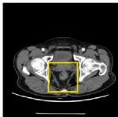  
(1) input image

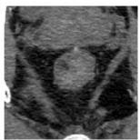

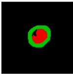  
(3) GT

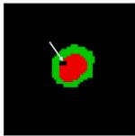  
(4) Ours

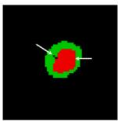

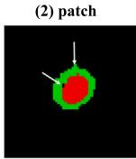

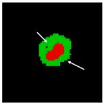  
(9) MISSFormer  
(8) ResUNet++  
(5) UNet

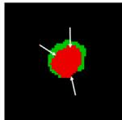  
(10) MultiResUNet

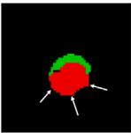

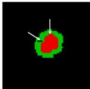  
(6) UNet+++

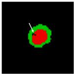

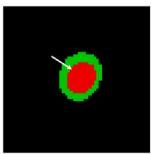  
(11) SwinUNet  
(7) AttenUNet

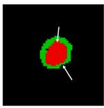  
(12) TransUNet  
(13) UCTransnet

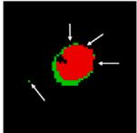  
(14) nnUNet

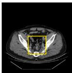

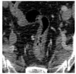  
(1) input image

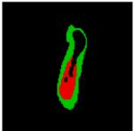

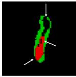  
(8) ResUNet++

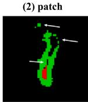  
(9) MISSFormer

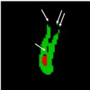

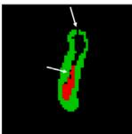

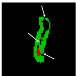

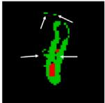  
(10) MultiResUNet

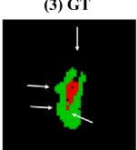

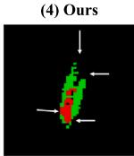  
(11) SwinUNet

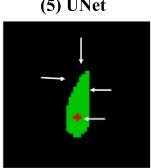  
(12) TransUNet  
(6) UNet+++

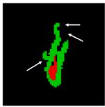  
(13) UCTransnet  
(7) AttenUNet

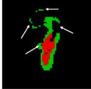  
(14) nnUNet

Fig. 7. The qualitative comparison on CARE dataset. From (1) to (14) are input image, patch of (1), ground truth (GT) of (2), results by our GLocalSeg and other state-of-the-art methods. Green indicates normal rectal tissue, while the red represents rectal cancer tumors. The white arrows highlight the discrepancies between the predictions of these methods and the ground truth. Compared with the other methods, our GLocalSeg achieves superior segmentation results.  
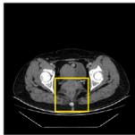  
(1) input image

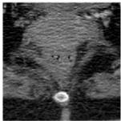

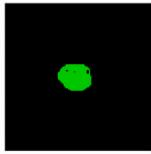  
(2) patch

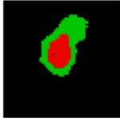  
(8) ResUNet++

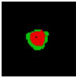

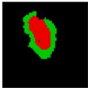

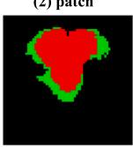  
(9) MISSFormer

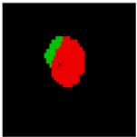

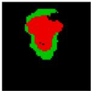  
(7) AttenUNet

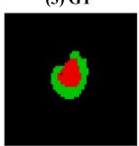  
(10) MultiResUNet  
(6) UNet+++

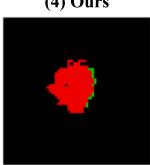  
(11) SwinUNet

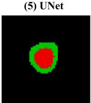  
(12) TransUNet

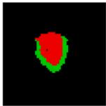  
(13) UCTransnet

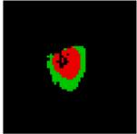  
(14) nnUNet

Fig. 8. The qualitative comparison of a failure case on CARE dataset. From (1) to (14) are the input image, the zoomed-in patch of (1), the ground truth (GT) of (2), and the segmentation results produced by our GLocalSeg and other state-of-the-art methods. Green indicates normal rectal tissue, while red denotes the tumor region. In this case, the GT contains only normal rectal tissue, yet all methods mistakenly classify certain areas as tumor. Among all methods, GLocalSeg produces the smallest mis-segmented area.

normal rectal tissue makes it difficult for the network to fully learn their structural characteristics. Despite the mis-segmentation, the prediction of GLocalSeg exhibits an overall shape that is closer to the ground truth, with less deformation.

Case-type Analysis: To further evaluate the robustness of the proposed method under challenging clinical conditions, we conduct a case-type analysis on CARE dataset by separately examining cases with small tumors and cases with blurred boundaries. The corresponding quantitative results are reported in Table 4, and representative visual examples are provided in Fig. 9.

For small-tumor cases, most competing methods tend to either under-segment or completely miss the lesion. In contrast, GLocalSeg achieves more stable Dice/IoU scores and produces segmentations that are closer to the ground truth. This indicates that the dual-encoder design effectively captures both subtle local textures and contextual cues that help localize tiny lesions. For blurred-boundary cases, CNNs-based methods often produce over-smoothed predictions, while Transformerbased methods may generate fragmented contours. Benefiting from the global–local collaborative design, GLocalSeg preserves sharper boundaries and reduces boundary offsets, which is reflected by lower HD95 and ASD values.

Table 3  
Comparison results of computational efficiency of different methods.
<table><tr><td>Methods</td><td>Params</td><td>FLOPs</td><td>Time (ms)</td><td>FPS</td><td>Memory (MB)</td></tr><tr><td>UNet [10]</td><td>1.81M</td><td>2.29G</td><td>1.26</td><td>795.90</td><td>30.16</td></tr><tr><td>Unet+++ [35]</td><td>23.13M</td><td>75.87G</td><td>5.08</td><td>196.86</td><td>420.75</td></tr><tr><td>AttenUNet [36]</td><td>34.88M</td><td>50.96G</td><td>3.25</td><td>308.09</td><td>241.27</td></tr><tr><td>ResUNet++ [11]</td><td>14.48M</td><td>54.30G</td><td>3.55</td><td>281.96</td><td>187.80</td></tr><tr><td>MISSFormer [13]</td><td>35.45M</td><td>7.26G</td><td>11.29</td><td>88.60</td><td>287.56</td></tr><tr><td>MultiResUNet [24]</td><td>7.25M</td><td>14.35G</td><td>3.49</td><td>222.28</td><td>353.93</td></tr><tr><td>SwinUNet [25]</td><td>27.15M</td><td>5.92G</td><td>6.09</td><td>164.34</td><td>385.36</td></tr><tr><td>TransUNet [28]</td><td>91.52M</td><td>22.33G</td><td>4.05</td><td>246.62</td><td>610.16</td></tr><tr><td>UCTransNet [29]</td><td>66.24M</td><td>32.93G</td><td>15.97</td><td>62.62</td><td>605.26</td></tr><tr><td>nnUNet [37]</td><td>7.39M</td><td>3.24G</td><td>2.32</td><td>430.88</td><td>541.95</td></tr><tr><td>GLocalSeg (ours)</td><td>192.40M</td><td>109.29G</td><td>13.66</td><td>73.22</td><td>911.02</td></tr></table>

Table 4  
Case-type analysis on the CARE dataset. The best results are highlighted in bold.
<table><tr><td rowspan="2">Case</td><td rowspan="2">Case type</td><td rowspan="2">Methods</td><td colspan="4">Normal</td><td colspan="4">Tumor</td></tr><tr><td>Dice (%)</td><td>IoU (%)</td><td>HD95 (mm)</td><td>ASD (mm)</td><td>Dice (%)</td><td>IoU (%)</td><td>HD95 (mm)</td><td>ASD (mm)</td></tr><tr><td rowspan="9">case17110963 slice005</td><td rowspan="9"></td><td>UNet [10]</td><td>71.18</td><td>55.25</td><td>4.0000</td><td>1.1191</td><td>0</td><td>0</td><td>6.6038</td><td>3.1722</td></tr><tr><td>Unet+++ [35]</td><td>81.24</td><td>68.41</td><td>5.0000</td><td>1.1563</td><td>0</td><td>0</td><td>N/A</td><td>N/A</td></tr><tr><td>AttenUNet [36]</td><td>83.31</td><td>71.39</td><td>4.0000</td><td>0.9764</td><td>0</td><td>0</td><td>N/A</td><td>N/A</td></tr><tr><td>ResUNet++ [11]</td><td>87.11</td><td>77.16</td><td>4.0000</td><td>0.6932</td><td>0</td><td>0</td><td>N/A</td><td>N/A</td></tr><tr><td>MISSFormer [13]</td><td>74.58</td><td>59.46</td><td>5.0000</td><td>1.4430</td><td>0</td><td>0</td><td>N/A</td><td>N/A</td></tr><tr><td>MultiResUNet [24]</td><td>84.05</td><td>72.48</td><td>5.0000</td><td>0.9790</td><td>0</td><td>0</td><td>6.0828</td><td>3.1479</td></tr><tr><td>SwinUNet [25]</td><td>59.47</td><td>42.32</td><td>8.0000</td><td>2.4405</td><td>0</td><td>0</td><td>N/A</td><td>N/A</td></tr><tr><td>TransUNet [28]</td><td>60.30</td><td>43.16</td><td>9.0000</td><td>1.9580</td><td>0</td><td>0</td><td>9.0554</td><td>4.8528</td></tr><tr><td>UCTransNet [29]</td><td>83.88 64.44</td><td>72.23 47.53</td><td>4.0000 9.0000</td><td>0.8788 1.8820</td><td>0 0</td><td>0 0</td><td>N/A 7.0000</td><td>N/A 3.8652</td></tr><tr><td rowspan="9">case17110716_slice007 Small tumor</td><td>nnUNet [37] GLocalSeg (Ours)</td><td>81.57</td><td>68.87</td><td>2.8284</td><td>0.6354</td><td>48.35</td><td>31.88</td><td>4.0000</td><td>1.5677</td></tr><tr><td>UNet [10]</td><td>50.34</td><td>33.64</td><td>5.0000</td><td></td><td>37.97</td><td>23.44</td><td>5.1891</td><td></td></tr><tr><td>Unet+++ [35]</td><td>53.18</td><td>36.22</td><td>6.7082</td><td>1.1849 1.3615</td><td>66.67</td><td>50.00</td><td>19.0000</td><td>2.1093 4.7222</td></tr><tr><td>AttenUNet [36]</td><td>59.91</td><td>42.77</td><td>7.6158</td><td>1.4272</td><td>48.24</td><td>31.78</td><td>5.0792</td><td>1.6352</td></tr><tr><td></td><td>60.75</td><td>43.63</td><td>7.1691</td><td>1.4307</td><td>56.82</td><td>39.68</td><td>14.8295</td><td></td></tr><tr><td>ResUNet++ [11]</td><td>55.21</td><td>38.13</td><td>8.9272</td><td></td><td>54.77</td><td>37.71</td><td>16.0203</td><td>4.2013</td></tr><tr><td>MISSFormer [13]</td><td>62.31</td><td>45.25</td><td>3.6056</td><td>1.7608 0.9958</td><td>27.79</td><td>16.14</td><td>25.0200</td><td>4.9351</td></tr><tr><td>MultiResUNet [24]</td><td>63.91</td><td>46.96</td><td>5.8310</td><td>1.4358</td><td>66.93</td><td>50.29</td><td>17.4770</td><td>8.8539 4.2358</td></tr><tr><td>SwinUNet [25] TransUNet [28]</td><td>54.05</td><td>37.03</td><td>5.0000</td><td>1.2964</td><td>40.69</td><td>25.54</td><td>23.0087</td><td></td></tr><tr><td>UCTransNet [29]</td><td>60.00</td><td>42.86</td><td>7.6158</td><td>1.7976</td><td>42.64</td><td>27.11</td><td>20.0187</td><td></td><td>9.2281 6.9765</td></tr><tr><td>nnUNet [37]</td><td>59.54</td><td>42.39</td><td></td><td>7.0036</td><td>1.5450</td><td>47.87</td><td>31.47</td><td>16.2357</td><td>4.9659</td></tr><tr><td></td><td>GLocalSeg (Ours) 77.81</td><td></td><td>63.68</td><td>2.2361</td><td>0.5679</td><td>76.92</td><td>62.50</td><td>17.3514</td><td>2.8726</td></tr><tr><td rowspan="8">Blurred boundary</td><td>UNet [10]</td><td>45.59</td><td>29.53</td><td>6.0000</td><td>1.5141</td><td>58.23</td><td>41.08</td><td>28.4191</td><td>4.9363</td></tr><tr><td>Unet+++ [35] AttenUNet [36]</td><td>67.18 69.17</td><td>50.58</td><td>3.6056</td><td>0.8129</td><td>84.70</td><td>73.46</td><td>8.0031</td><td>1.3937</td></tr><tr><td></td><td>64.55</td><td>52.87 47.65</td><td>2.8284</td><td>0.6747</td><td>87.52</td><td>77.80</td><td>27.8171</td><td>3.9862</td></tr><tr><td>ResUNet++ [11]</td><td></td><td></td><td>4.6833</td><td>0.8781</td><td>77.75</td><td>63.60</td><td>13.2427</td><td>2.5158</td></tr><tr><td>MISSFormer [13]</td><td>64.88</td><td>48.01</td><td>3.1623</td><td>0.8265</td><td>88.29</td><td>79.03</td><td>5.0000</td><td>1.3951</td></tr><tr><td>MultiResUNet [24]</td><td>65.00</td><td>48.15</td><td>6.1069</td><td>1.7908</td><td>86.35</td><td>75.99</td><td>5.0297</td><td>0.9278</td></tr><tr><td>SwinUNet [25]</td><td>55.27</td><td>38.19</td><td>6.7082</td><td>1.4874</td><td>83.56</td><td>71.76</td><td>19.0238</td><td>2.4930</td></tr><tr><td>TransUNet [28]</td><td>20.21</td><td>11.24</td><td></td><td>6.4031</td><td>2.4003</td><td>37.83</td><td>23.32</td><td>13.3936</td><td>4.5544</td></tr><tr><td rowspan="8"></td><td>UCTransNet [29]</td><td>59.02</td><td>41.86</td><td>22.5059</td><td>3.4822</td><td>76.96</td><td>62.55</td><td>27.2947</td><td>5.8341</td></tr><tr><td>nnUNet [37]</td><td>40.25</td><td>25.19</td><td>9.0000</td><td>2.2672</td><td>56.19</td><td>39.07</td><td>14.4567</td><td>4.1367</td></tr><tr><td>GLocalSeg (Ours)</td><td>72.47</td><td>56.83</td><td>2.0000</td><td>0.5167</td><td>92.66</td><td>86.33</td><td>2.0000</td><td>0.3971</td></tr><tr><td>UNet [10]</td><td>78.86</td><td>65.09</td><td>8.5205</td><td>2.1531</td><td>N/A</td><td>N/A</td><td>N/A</td><td>N/A</td></tr><tr><td>Unet+++ [35]</td><td>71.58</td><td>55.74</td><td>8.5965</td><td>2.3059</td><td>0</td><td>0</td><td>N/A</td><td>N/A</td></tr><tr><td>AttenUNet [36]</td><td>63.70</td><td>46.74</td><td>9.4125</td><td>2.2547</td><td>0</td><td>0</td><td>N/A</td><td>N/A</td></tr><tr><td>ResUNet++ [11]</td><td>73.36</td><td>57.92</td><td>6.6472</td><td>1.4853</td><td>0</td><td>0</td><td>N/A</td><td>N/A</td></tr><tr><td>MISSFormer [13]</td><td>76.27</td><td>61.64</td><td>8.0000</td><td>2.3347</td><td>0</td><td>0</td><td>N/A</td><td>N/A</td></tr><tr><td rowspan="7">case17630007_slice003 Blurred boundary UCTransNet [29]</td><td></td><td>59.61</td><td>42.46</td><td>9.9698</td><td>3.0520</td><td>0</td><td>0</td><td>N/A</td><td>N/A</td></tr><tr><td>MultiResUNet [24]</td><td>81.19</td><td>68.34</td><td>5.0000</td><td>1.7122</td><td>N/A</td><td>N/A</td><td>N/A</td><td>N/A</td></tr><tr><td>SwinUNet [25] TransUNet [28]</td><td>84.95</td><td>73.83</td><td>5.0000</td><td>1.3366</td><td>N/A</td><td>N/A</td><td>N/A</td><td>N/A</td></tr><tr></table>

It is worth noting that different failure modes correspond to different metric behaviors. When Dice = 0 with finite HD95/ASD, the model predicts a lesion at an incorrect location (complete mis-overlap). When Dice = 0 and HD95/ASD = N/A, the tumor exists in the ground truth but is completely missed by the model. Finally, when all tumor metrics are N/A, the tumor is absent in both the ground truth and prediction, and the metrics are undefined. These observations further confirm that GLocalSeg not only improves overall accuracy, but is particularly reliable in difficult scenarios commonly encountered in rectal cancer CT.

## 5.1.2. Results on TeddyCup dataset

Segmentation Accuracy: From Table 5, we can observe that even on the highly limited and extremely imbalanced TeddyCup dataset, our GLocalSeg still achieves a remarkable lead across all evaluation metrics. Specifically, GLocalSeg surpasses the second-best method by 1.15% in Dice and 0.75% in IoU, while also delivering superior performance in HD95 and ASD. It is worth noting that the TeddyCup dataset contains only 860 slices with visible rectal tumors, whereas the remaining 2172 slices include only background without any tumor regions. This imbalance makes it difficult for most methods to learn effective tumor features. However, GLocalSeg is able to robustly capture local lesion information and integrate global structural cues even under such challenging data conditions, demonstrating strong capability in small-sample learning.

Table 5  
Comparison results of different segmentation methods on TeddyCup dataset. The best results are highlighted in bold.
<table><tr><td rowspan="2">Methods</td><td colspan="4">Tumor</td></tr><tr><td>Dice (%)</td><td>IoU (%)</td><td>HD95 (mm)</td><td>ASD (mm)</td></tr><tr><td>UNet [10]</td><td>57.19</td><td>44.18</td><td>6.7957</td><td>1.0579</td></tr><tr><td>Unet+++ [35]</td><td>65.85</td><td>50.94</td><td>11.9257</td><td>3.9649</td></tr><tr><td>AttenUNet [36]</td><td>59.14</td><td>44.22</td><td>17.3290</td><td>5.2944</td></tr><tr><td>ResUNet++ [11]</td><td>62.00</td><td>47.04</td><td>15.7227</td><td>4.5539</td></tr><tr><td>MISSFormer [13]</td><td>62.29</td><td>47.86</td><td>11.2414</td><td>2.8841</td></tr><tr><td>MultiResUNet [24]</td><td>65.38</td><td>50.39</td><td>6.6516</td><td>2.0955</td></tr><tr><td>SwinUNet [25]</td><td>45.67</td><td>32.32</td><td>12.6006</td><td>4.1817</td></tr><tr><td>TransUNet [28]</td><td>47.75</td><td>33.40</td><td>25.2829</td><td>7.6199</td></tr><tr><td>UCTransNet [29]</td><td>62.17</td><td>47.08</td><td>11.0124</td><td>2.5684</td></tr><tr><td>nnUNet [37]</td><td>62.65</td><td>47.38</td><td>9.2783</td><td>2.6120</td></tr><tr><td>GLocalSeg(ours)</td><td>67.00</td><td>51.69</td><td>8.7844</td><td>2.3415</td></tr></table>

Qualitative Results: To provide a clear visual demonstration of the superiority of GLocalSeg, we present qualitative comparisons in

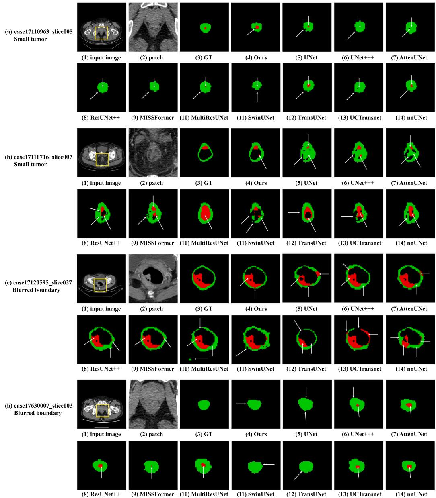  
Fig. 9. Qualitative comparison of representative CARE cases in two challenging scenarios: small tumors and blurred boundaries. For each case, we show the input image, zoomed-in lesion, ground truth, and segmentation results (green: normal rectum, red: tumor). Small tumors often lead to under-segmentation, while blurred boundaries cause leakage or over-segmentation. GLocalSeg consistently provides more accurate tumor localization and clearer boundaries with fewer false positives.

Fig. 10. As shown in the figure, other methods often exhibit fragmented boundaries, mis-segmentation, or partial missing regions near the tumor areas, whereas GLocalSeg produces predictions much closer to the ground truth, especially in terms of contour continuity and region completeness. This advantage stems from the model’s global– local collaborative design, which enables it to perceive long-range structural relationships while accurately capturing fine-grained tumor boundaries.

## 5.2. Ablation studies

To comprehensively evaluate the contribution of each component in our proposed GLocalSeg, we conduct a series of ablation studies on the CARE dataset. Specifically, we analyze the effectiveness of the CSDA module, the ViT encoder, the HybridFusionCDG module, the lossweighting factor $\lambda ,$ and different ViT pretraining strategies. These ablations enable us to systematically assess how local detail enhancement, global contextual modeling, multi-scale feature fusion, loss balancing, and pretrained initialization collectively influence performance. The detailed results are presented in Tables 4–6.

We construct three baseline variants, denoted as Model0–Model2. Model0 serves as the fundamental UNet backbone. Model1 enhances the encoder of Model0 by integrating the proposed CSDA module. Model2 introduces a dual-parallel encoder by combining the CSDAenhanced UNet encoder with a ViT encoder, where the fusion between CNNs features and ViT features is achieved through a simple strategy involving channel alignment, element-wise addition, and a subsequent 3 × 3 convolution. Building upon Model2, our GLocalSeg adds the HybridFusionCDG module, which enables deeper fusion between local detailed and global contextual features.

## 5.2.1. Analysis on the CSDA module

As shown in Table 6, introducing the CSDA module notably improves the segmentation performance. Specifically, Model1 achieves a

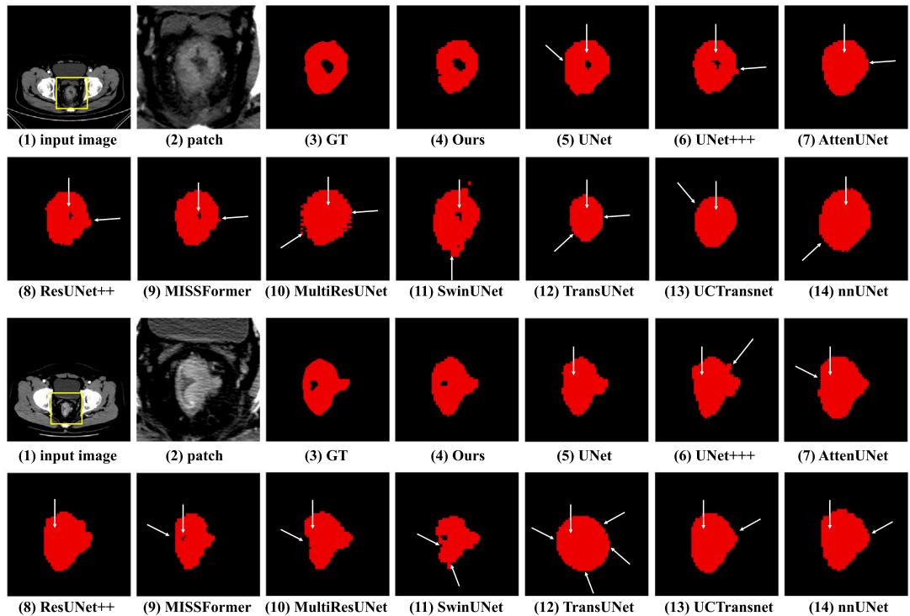  
Fig. 10. The qualitative comparison on TeddyCup dataset. From (1) to (14) are input image, patch of (1), ground truth (GT) of (2), results by our GLocalSeg and other state-of-the-art methods. Red represents rectal cancer tumors. The white arrows highlight the discrepancies between the predictions of these methods and the ground truth. Compared with the other methods, our GLocalSeg achieves superior segmentation results.

Table 6  
Ablation studies on CARE dataset.
<table><tr><td rowspan="2">Methods</td><td colspan="3">Components</td><td colspan="4">Mean</td><td rowspan="2">Params</td><td rowspan="2">FLOPs</td><td rowspan="2">Time (ms)</td><td rowspan="2">FPS</td><td rowspan="2">Memory (MB)</td></tr><tr><td>CSDA</td><td>ViT</td><td>HybridFusionCDG</td><td>Dice (%)</td><td>IoU (%)</td><td>HD95 (mm)</td><td>ASD (mm)</td></tr><tr><td>Model0</td><td></td><td></td><td></td><td>63.46</td><td>47.97</td><td>15.8214</td><td>4.8897</td><td>1.81M</td><td>2.29G</td><td>1.26</td><td>795.90</td><td>30.16</td></tr><tr><td>Model1</td><td>√</td><td></td><td></td><td>65.00</td><td>49.61</td><td>14.7525</td><td>4.6206</td><td>36.14M</td><td>52.32G</td><td>7.55</td><td>132.49</td><td>262.84</td></tr><tr><td>Model2</td><td>√</td><td>√</td><td></td><td>66.22</td><td>50.83</td><td>13.1656</td><td>4.1047</td><td>137.00M</td><td>78.78G</td><td>11.49</td><td>87.04</td><td>678.90</td></tr><tr><td>GLocalSeg(ours)</td><td>√</td><td>√ √</td><td></td><td>67.27</td><td>51.95</td><td>11.3775</td><td>3.5519</td><td>192.40M</td><td>109.29G</td><td>13.66</td><td>73.22</td><td>911.02</td></tr></table>

Mean Dice of 65.00%, Mean IoU of 49.61%, HD95 of 14.7525 mm, and ASD of 4.6206 mm, outperforming the baseline Model0 by 1.54%, 1.64%, 1.0689 mm, and 0.2691 mm, respectively. These improvements verify the effectiveness of CSDA in enhancing local feature representation. Since rectal CT images often exhibit low contrast and blurred boundaries, the parallel channel–spatial attention mechanism in CSDA enables the network to emphasize boundary-relevant structures while suppressing irrelevant responses. As a result, the encoder gains stronger capability in capturing fine-grained details, leading to more complete boundary delineation and higher overall segmentation accuracy.

## 5.2.2. Analysis on the ViT encoder

While CNNs-based encoder is effective at extracting local details, their limited receptive field restricts their ability to capture long-range dependencies, which is crucial for rectal CT images characterized by diffuse boundaries and ambiguous global structures. To address this limitation, we introduce a ViT encoder on top of Model1, forming Model2, which augments the network with global contextual modeling capability. As shown in Table 6, Model2 achieves a Mean Dice of 66.22%, Mean IoU of 50.83%, HD95 of 13.1656 mm, and ASD of 4.1047 mm, outperforming Model1 by 1.22%, 1.22%, 1.5869 mm, and 0.5159 mm, respectively. These improvements demonstrate the benefit of integrating global information. Specifically, the added ViT encoder supplies complementary long-range structural cues, helping the model better distinguish tumor boundaries from surrounding tissues and reducing large boundary deviations.

Despite these clear performance gains, introducing the dual-parallel encoder inevitably increases the computational burden. As shown in Table 6, the parameter count rises from 36.14M in Model1 to 137.00M in Model2, and FLOPs increase from 52.32G to 78.78G. The inference speed also decreases from 132.49 FPS to 87.04 FPS, reflecting the additional cost introduced by the ViT encoder. Nevertheless, this trade-off remains acceptable, as the global contextual information provided by the ViT encoder lead to substantially improved structural consistency and boundary accuracy, demonstrating that the enhanced segmentation performance justifies the moderate increase in complexity.

## 5.2.3. Analysis on the HybridFusionCDG module

After the introduction of the HybridFusionCDG module, the segmentation performance of the model has been further improved on the basis of the dual-parallel encoder. Compared with Model2, the Mean Dice of GLocalSeg has increased by 1.05%, the average IoU has increased by 1.12%, and the HD95 and ASD have decreased by 1.7881 mm and 0.5528 mm respectively. These results fully verify the effectiveness of HybridFusionCDG in achieving deeper and more coherent global–local feature fusion. Relying on its edge-guided enhanced branches, this module can strengthen structural information in areas where the boundary between the rectum and the tumor is blurred or partially broken. Meanwhile, semantic difference modeling explicitly reveals the differences between the local features of CNNs and the global features of ViT, enabling the network to focus on those fuzzy or transitional regions that are prone to over-segmentation or undersegmentation. In addition, the bidirectional gated fusion mechanism can adaptively adjust the information flow between the two types of features, enabling CNNs features to absorb a more consistent global context while avoiding excessive smoothing of boundary details by ViT features during the fusion process. Therefore, the fused features are more reliable in structure and more consistent in semantics, thereby significantly improving boundary integrity and overall segmentation accuracy.

Table 7  
Ablation studies of the hyperparameter ?? of our GLocalSeg on CARE dataset. The best results are highlighted in bold.
<table><tr><td rowspan="2">λ</td><td colspan="4">Normal</td><td colspan="4">Tumor</td><td colspan="4">Mean</td></tr><tr><td>Dice (%)</td><td>IoU (%)</td><td>HD95 (mm)</td><td>ASD (mm)</td><td>Dice (%)</td><td>IoU (%)</td><td>HD95 (mm)</td><td>ASD (mm)</td><td>Dice (%)</td><td>IoU (%)</td><td>HD95 (mm)</td><td>ASD (mm)</td></tr><tr><td>0.2</td><td>61.04</td><td>44.82</td><td>10.4213</td><td>2.9970</td><td>71.32</td><td>56.90</td><td>16.1071</td><td>5.1849</td><td>66.18</td><td>50.86</td><td>13.2642</td><td>4.0910</td></tr><tr><td>0.4</td><td>63.94</td><td>47.81</td><td>10.0314</td><td>2.8301</td><td>70.02</td><td>55.38</td><td>14.1853</td><td>4.3773</td><td>66.98</td><td>51.60</td><td>12.1084</td><td>3.6037</td></tr><tr><td>0.6</td><td>64.44</td><td>48.38</td><td>8.7488</td><td>2.6716</td><td>70.09</td><td>55.51</td><td>14.0061</td><td>4.4322</td><td>67.27</td><td>51.95</td><td>11.3775</td><td>3.5519</td></tr><tr><td>0.8</td><td>61.67</td><td>45.52</td><td>12.8354</td><td>3.6906</td><td>68.88</td><td>54.25</td><td>19.2129</td><td>5.8158</td><td>65.27</td><td>49.89</td><td>16.0241</td><td>4.7532</td></tr></table>

Table 8  
Results and computational efficiency comparison of different training strategies on CARE dataset.
<table><tr><td rowspan="2">Strategies</td><td colspan="4">Normal</td><td colspan="4">Tumor</td><td colspan="4">Mean</td><td rowspan="2">Time</td><td rowspan="2">Memory (GB)</td></tr><tr><td>Dice (%)</td><td>IoU (%)</td><td>HD95 (mm)</td><td>ASD (mm)</td><td>Dice (%)</td><td>IoU (%)</td><td>HD95 (mm)</td><td>ASD (mm)</td><td>Dice (%)</td><td>IoU (%)</td><td>HD95 (mm)</td><td>ASD (mm) (min)</td></tr><tr><td>Strategy1</td><td>63.78</td><td>47.69</td><td>9.7633</td><td>2.9099</td><td>70.14</td><td>55.24</td><td>13.1255</td><td>4.0054</td><td>66.96</td><td>51.47</td><td>11.4444</td><td>3.4576</td><td>14</td><td>18.9</td></tr><tr><td>Strategy2</td><td>62.32</td><td>46.27</td><td>11.0034</td><td>3.2395</td><td>68.85</td><td>54.15</td><td>15.1706</td><td>4.7590</td><td>65.59</td><td>50.21</td><td>13.0870</td><td>3.9992</td><td>18</td><td>16.2</td></tr><tr><td>Strategy3</td><td>64.44</td><td>48.38</td><td>8.7488</td><td>2.6716</td><td>70.09</td><td>55.51</td><td>14.0061</td><td>4.4322</td><td>67.27</td><td>51.95</td><td>11.3775</td><td>3.5519</td><td>20</td><td>18.4</td></tr></table>

Table 9  
Ablation studies of input resolution and ViT parameters in terms of segmentation performance on CARE dataset.
<table><tr><td rowspan="2">Variant</td><td rowspan="2">Input</td><td rowspan="2">Patch</td><td rowspan="2">Heads</td><td rowspan="2">Batch Normal</td><td colspan="4"></td><td colspan="4">Tumor</td><td colspan="4">Mean</td></tr><tr><td>Dice</td><td>IoU</td><td>HD95</td><td>ASD</td><td>Dice</td><td>IoU</td><td>HD95</td><td>ASD</td><td>Dice</td><td>IoU</td><td>HD95</td><td>ASD</td></tr><tr><td></td><td></td><td></td><td></td><td></td><td>(%)</td><td>(%)</td><td>(mm)</td><td>(mm)</td><td>(%)</td><td>(%)</td><td>(mm)</td><td>(mm)</td><td>(%)</td><td>(%)</td><td>(mm)</td><td>(mm)</td></tr><tr><td>Ours</td><td> $2 2 4 \times 2 2 4$ </td><td> $1 6 \times 1 6$ </td><td>12</td><td>16</td><td>64.44</td><td>48.38</td><td>8.7488</td><td>2.6716</td><td>70.09</td><td>55.51</td><td>14.0061</td><td>4.4322</td><td>67.27</td><td>51.95</td><td>11.3775</td><td>3.5519</td></tr><tr><td>Large image</td><td> $5 1 2 \times 5 1 2$ </td><td> $1 6 \times 1 6$ </td><td>12</td><td>2</td><td>66.58 62.85</td><td>50.99 46.59</td><td>13.1022 10.3387</td><td>4.0312 3.0561</td><td>72.54 70.41</td><td>58.17 55.86</td><td>13.8527 15.9609</td><td>4.5060 5.0561</td><td>69.56 66.63</td><td>54.58 51.23</td><td>13.4775 13.1498</td><td>4.2686 4.0561</td></tr><tr><td>Few heads More heads</td><td> $2 2 4 \times 2 2 4$   $2 2 4 \times 2 2 4$ </td><td> $1 6 \times 1 6$   $1 6 \times 1 6$ </td><td>6 16</td><td>16 16</td><td>60.20</td><td>43.90</td><td>16.5955</td><td>4.6735</td><td>70.37</td><td>55.74</td><td>17.8112</td><td>5.8457</td><td>65.28</td><td>49.82</td><td>17.2034</td><td>5.2596</td></tr><tr><td></td><td></td><td></td><td></td><td></td><td></td><td></td><td></td><td></td><td></td><td></td><td></td><td></td><td></td><td></td><td></td><td></td></tr></table>

## 5.2.4. Analysis on ??

To investigate the influence of the loss-weighting factor ??, we evaluate representative values (0.2, 0.4, 0.6, 0.8), which cover the low-, mid-, and high-weighting regimes of Dice loss. As shown in Table 7, moderate values of ?? consistently yield more balanced performance across both region-overlap metrics and boundary-sensitive metrics. In particular, $\lambda ~ = ~ 0 . 6$ achieves the best overall mean Dice and IoU while also producing the lowest HD95 and ASD, indicating superior structural consistency and boundary precision. When ?? is relatively small, the optimization is dominated by Cross-Entropy loss, which enhances pixel-wise discrimination but provides insufficient global regularization. This leads to less stable region delineation, especially in low-contrast rectal CT images. Conversely, when ?? becomes too large, Dice loss starts to dominate the learning process, strengthening regional consistency but reducing the fine-grained supervision necessary for accurate boundary localization. As a result, boundary-related metrics deteriorate. Therefore, $\lambda ~ = ~ 0 . 6$ represents an effective balance between pixel-level fidelity and global structural coherence, leveraging the complementary strengths of Cross-Entropy and Dice losses. This configuration provides the most robust and stable segmentation performance, and is thus selected as the default setting in our method.

## 5.2.5. Analysis on ViT pretraining strategies

As shown in Table 8, the three ViT pretraining strategies exhibit clear differences in performance. Strategy1 trains the ViT encoder from scratch and achieves moderate segmentation accuracy, but lacks strong global priors. Strategy2 loads SAM-ViT-B pretrained weights but freezes the encoder, resulting in the lowest performance among the three strategies. This degradation occurs because SAM-ViT-B is pretrained on natural images, and a frozen encoder cannot adapt to the distinct grayscale distribution, low contrast, and structural patterns of medical

CT images. Strategy3, which loads the pretrained weights and allows full fine-tuning, avoids this domain-mismatch problem. By enabling the ViT encoder to gradually adjust to medical image characteristics, Strategy3 achieves the best Dice, IoU, and boundary-related metrics.

In addition, the Time and Memory columns in Table 8 reflect the approximate per-epoch training time and GPU memory consumption required by each strategy. Strategy1 is the fastest and least memoryintensive, while Strategy3 incurs the highest training time and memory usage due to full-parameter optimization. Therefore, for scenarios constrained by computational resources, Strategy1 or Strategy2 offers a more efficient option. When segmentation accuracy is prioritized and hardware resources allow, Strategy3 remains the recommended configuration.

## 5.2.6. Analysis of input resolution and ViT architectural parameters

To further investigate the impact of model configuration on segmentation performance and efficiency, we conduct an ablation study on input resolution and ViT architectural parameters, as summarized in Tables 9 and 10. In addition to segmentation metrics in Tables 9, 10 reports model parameters (Params), computational complexity (FLOPs), inference time per image $( \mathrm { T i m e _ { i n f } } ) _ { \mathrm { : } }$ , GPU memory consumption (Memory), and the training time per epoch $( \mathrm { T i m e } _ { \mathrm { e p o c h } }$ (min)), providing a comprehensive evaluation of both accuracy and efficiency.

Input Resolution. We compare two input resolutions, 224 × 224 and $5 1 2 \times 5 1 2$ , while keeping the patch size fixed at $1 6 \times 1 6 .$ . Increasing the input resolution leads to consistent performance improvements, as higher-resolution inputs preserve finer spatial details and object boundaries. However, this gain comes at a significant computational cost: the inference time per image and the training time per epoch increase by approximately four times, and GPU memory consumption also rises substantially. Therefore, although $5 1 2 \times 5 1 2$ achieves better accuracy, 224 × 224 offers a more favorable trade-off between performance and efficiency.

Attention Heads. We further analyze the effect of varying the number of attention heads (6, 12, and 16). The results show that different head configurations lead to noticeable performance variations. Using fewer heads increases the dimensionality of each head, which may limit the diversity of contextual interactions, while using more heads reduces the per-head capacity, potentially weakening feature expressiveness.

Table 10  
Ablation studies of input resolution and ViT parameters in terms of computational efficiency on CARE dataset.
<table><tr><td>Variant</td><td>Input</td><td>Patch</td><td>Heads</td><td>Batch</td><td>Params</td><td>FLOPs</td><td> ${ \mathrm { T i m e } } _ { \mathrm { i n f } } ~ ( \mathrm { m s } )$ </td><td>Memory (MB)</td><td> $\mathrm { T i m e } _ { \mathrm { e p o c h } }$  (min)</td></tr><tr><td>Ours</td><td> $2 2 4 \times 2 2 4$ </td><td> $1 6 \times 1 6$ </td><td>12</td><td>16</td><td>192.395M</td><td>109.292G</td><td> $1 3 . 6 5 6 7$ </td><td>911.0186</td><td>20</td></tr><tr><td>Large image</td><td> $5 1 2 \times 5 1 2$ </td><td> $1 6 \times 1 6$ </td><td>12</td><td>2</td><td>192.395M</td><td>570.996G</td><td>53.6650</td><td>1540.1465</td><td>74</td></tr><tr><td>Few heads</td><td> $2 2 4 \times 2 2 4$ </td><td> $1 6 \times 1 6$ </td><td>6</td><td>16</td><td>192.395M</td><td>109.292G</td><td>13.6480</td><td>911.0186</td><td>20</td></tr><tr><td>More heads</td><td> $2 2 4 \times 2 2 4$ </td><td> $1 6 \times 1 6$ </td><td>16</td><td>16</td><td>192.395M</td><td>109.292G</td><td>13.6009</td><td>911.0186</td><td>20</td></tr></table>

The default setting of 12 attention heads provides a balanced tradeoff between representation diversity and per-head capacity, resulting in more stable and superior performance.

Overall, these results demonstrate that our method is robust to moderate variations in ViT architecture. Considering both segmentation accuracy and computational efficiency, we adopt an input resolution of 224 × 224 with 12 attention heads as the default configuration in this work.

## 6. Discussion

In this paper, we propose GLocalSeg, a global–local collaborative segmentation method designed for accurate segment segmentation of rectum and tumor in CT images. The core ideas are: (1) introducing a dual-parallel encoder that jointly captures local detailed features and global contextual information through the Hybrid Attention CNNs encoder and the ViT encoder; (2) converting global contextual information into spatially aligned multi-scale feature maps via the MultiScale-Head to ensure consistent feature correspondence across stages; and (3) designing a HybridFusionCDG module that incorporates edge-guided enhancement, semantic-difference modeling, and gated bidirectional feature interaction, enabling deeper fusion between local and global features.

From a clinical perspective, GLocalSeg contributes to both early intervention and subsequent treatment planning. By providing more accurate and reliable segmentation in low-contrast CT images, it can help radiologists identify suspicious rectal lesions earlier and reduce variability in diagnosis. At the same time, the precise delineation of tumor boundaries and rectal structures facilitates downstream tasks such as treatment planning, surgical navigation, and radiation target volume definition, enabling more accurate volume measurement and fewer manual corrections. Overall, GLocalSeg has the potential to support clinical decision-making while reducing clinician workload.

Despite these strengths, several limitations warrant discussion. Our GLocalSeg requires high-quality pixel-level annotations during training, which imposes significant labeling workload on gastrointestinal specialists and introduces potential bias. Although our method captures complementary global–local feature, its performance is somewhat sensitive to class imbalance and relies on a carefully tuned loss weight. In addition, the relatively high computational cost of the dual-parallel encoder and multi-scale feature fusion module, while acceptable for modern GPUs, may limit deployment in resource-constrained clinical environments.

In future work, we aim to reduce reliance on fully supervised labels and enhance the efficiency of our method. By incorporating semisupervised or weakly supervised learning, the model could leverage large-scale unlabeled CT data, thereby minimizing annotation effort and mitigating human errors. Additionally, exploring model compression or lightweight variants could improve computational efficiency and facilitate integration into real-world clinical workflows.

## 7. Conclusion

We propose a global–local collaborative segmentation network named GLocalSeg for rectal cancer CT images. By introducing a dualparallel encoder to extract both local details and global contextual features, and performing their integration through the HybridFusion-CDG module, the proposed module achieves effective fusion of multiscale features. Experiments on two public datasets demonstrate that

GLocalSeg consistently outperforms current state-of-the-art methods in Dice, IoU, HD95, and ASD metrics, verifying its superior boundary completeness and segmentation reliability. Overall, our proposed method highlights the value of deep global–local collaboration in medical image segmentation, and offers a promising foundation for further advances in automated rectal cancer analysis.

## CRediT authorship contribution statement

Yunsong Li: Writing – original draft, Methodology. Gao Huang: Validation, Supervision. Xiao Huang: Validation, Supervision.

## Declaration of competing interest

The authors declare that they have no known competing financial interests or personal relationships that could have appeared to influence the work reported in this paper.

## Data availability

Data will be made available on request.

## References

[1] A.N. Giaquinto, H. Sung, L.A. Newman, R.A. Freedman, R.A. Smith, J. Star, A. Jemal, R.L. Siegel, Breast cancer statistics 2024, CA: Cancer J. Clin. 74 (6) (2024) 477–495, http://dx.doi.org/10.3322/caac.21863.

[2] D.S. Keller, M. Berho, R.O. Perez, S.D. Wexner, M. Chand, The multidisciplinary management of rectal cancer, Nat. Rev. Gastroenterol. Hepatol. 17 (7) (2020) 414–429, http://dx.doi.org/10.1038/s41575-020-0275-y.

[3] J. Kim, J.E. Oh, J. Lee, M.J. Kim, B.Y. Hur, D.K. Sohn, B. Lee, Rectal cancer: toward fully automatic discrimination of T2 and T3 rectal cancers using deep convolutional neural network, Int. J. Imaging Syst. Technol. 29 (3) (2019) 247–259, http://dx.doi.org/10.1002/ima.22311.

[4] F. Noort, F.t. Borg, A. Guitink, J. Faber, J. Wolterink, Deep learning for segmentation of colorectal carcinomas on endoscopic ultrasound, Tech. Coloproctology 29 (1) (2025) 1–8, http://dx.doi.org/10.1007/s10151-024-03056-5.

[5] F. Knuth, I.A. Adde, B.N. Huynh, A.R. Groendahl, R.M. Winter, A. Negård, S.H. Holmedal, S. Meltzer, A.H. Ree, K. Flatmark, et al., MRI-based automatic segmentation of rectal cancer using 2D U-Net on two independent cohorts, Acta Oncol. 61 (2) (2022) 255–263, http://dx.doi.org/10.1080/0284186X.2021. 2013530.

[6] M. Jiao, Z. Ma, Z. Gao, Y. Kong, S. Zhang, G. Yang, Z. Wang, The value of radiomics and deep learning based on PET/CT in predicting perineural nerve invasion in rectal cancer, Abdom. Radiol. (2025) 1–10, http://dx.doi.org/10. 1007/s00261-025-04833-y.

[7] S. Jardim, J. António, C. Mora, Image thresholding approaches for medical image segmentation-short literature review, Procedia Comput. Sci. 219 (2023) 1485–1492, http://dx.doi.org/10.1016/j.procs.2023.01.439.

[8] C. Cigla, A.A. Alatan, Region-based image segmentation via graph cuts, in: 2008 15th IEEE International Conference on Image Processing, IEEE, 2008, pp. 2272–2275, http://dx.doi.org/10.1109/ICIP.2008.4712244.

[9] Z. Yu-Qian, G. Wei-Hua, C. Zhen-Cheng, T. Jing-Tian, L. Ling-Yun, Medical images edge detection based on mathematical morphology, in: 2005 IEEE Engineering in Medicine and Biology 27th Annual Conference, IEEE, 2006, pp. 6492–6495, http://dx.doi.org/10.1109/IEMBS.2005.1615986.

[10] O. Ronneberger, P. Fischer, T. Brox, U-Net: Convolutional networks for biomedical image segmentation, in: Medical Image Computing and Computer-Assisted Intervention–MICCAI 2015: 18th International Conference, Munich, Germany, October 5-9, 2015, Proceedings, Part III 18, Springer, 2015, pp. 234–241, http://dx.doi.org/10.1007/978-3-319-24574-4\_28.

[11] D. Jha, P.H. Smedsrud, M.A. Riegler, D. Johansen, T. De Lange, P. Halvorsen, H.D. Johansen, ResUNet++: An advanced architecture for medical image segmentation, in: 2019 IEEE International Symposium on Multimedia, ISM, IEEE, 2019, pp. 225–2255, http://dx.doi.org/10.1109/ISM46123.2019.00049.

[12] S. Zheng, J. Lu, H. Zhao, X. Zhu, Z. Luo, Y. Wang, Y. Fu, J. Feng, T. Xiang, P.H. Torr, et al., Rethinking semantic segmentation from a sequence-to-sequence perspective with transformers, in: Proceedings of the IEEE/CVF Conference on Computer Vision and Pattern Recognition, 2021, pp. 6881–6890.

[13] X. Huang, Z. Deng, D. Li, X. Yuan, Y. Fu, Missformer: An effective transformer for 2d medical image segmentation, IEEE Trans. Med. Imaging 42 (5) (2022) 1484–1494, http://dx.doi.org/10.1109/TMI.2022.3230943.

[14] C. Hu, T. Xia, S. Ju, X. Li, When sam meets medical images: An investigation of segment anything model (sam) on multi-phase liver tumor segmentation, 2023, http://dx.doi.org/10.48550/arXiv.2304.08506, arXiv preprint arXiv:2304.08506.

[15] J. Ma, Y. He, F. Li, L. Han, C. You, B. Wang, Segment anything in medical images, Nat. Commun. 15 (1) (2024) 654, http://dx.doi.org/10.1038/s41467- 024-44824-z.

[16] J. Yan, M. Han, T. Xiong, H. Gu, Q. Jia, Y. Gao, Preoperative prediction of rectal cancer stage via CT imaging and an adaptive attention multiscale feature fusion network, Biomed. Signal Process. Control. 112 (2026) 108415, http://dx.doi.org/10.1016/j.bspc.2025.108415.

[17] S. Trebeschi, J.J. van Griethuysen, D.M. Lambregts, M.J. Lahaye, C. Parmar, F.C. Bakers, N.H. Peters, R.G. Beets-Tan, H.J. Aerts, Deep learning for fully-automated localization and segmentation of rectal cancer on multiparametric MR, Sci. Rep. 7 (1) (2017) 5301, http://dx.doi.org/10.1038/s41598-017-05728-9.

[18] G. Zhang, L. Chen, A. Liu, X. Pan, J. Shu, Y. Han, Y. Huan, J. Zhang, Comparable performance of deep learning–based to manual-based tumor segmentation in KRAS/NRAS/BRAF mutation prediction with MR-based radiomics in rectal cancer, Front. Oncol. 11 (2021) 696706, http://dx.doi.org/10.3389/fonc.2021. 696706.

[19] K. Zhang, X. Yang, Y. Cui, J. Zhao, D. Li, Imaging segmentation mechanism for rectal tumors using improved U-Net, BMC Med. Imaging 24 (1) (2024) 95, http://dx.doi.org/10.1186/s12880-024-01269-6.

[20] K. Zhang, X. Yang, Y. Cui, J. Zhao, D. Li, Automatic segmentation of rectal tumors from MRI using multiscale densely connected convolutional neural network based on attention mechanism, Phys. Med. Biol. 68 (16) (2023) 165001, http://dx.doi.org/10.1088/1361-6560/ace6f2.

[21] K. Li, B. Qi, M. Wang, Magnetic resonance image segmentation of rectal tumors based on improved CycleGAN and U-Net models, Multimedia Tools Appl. 83 (11) (2024) 33555–33571, http://dx.doi.org/10.1007/s11042-023-16866-w.

[22] P. Meng, J. Li, C. Sun, Y. Li, L. Zhou, X. Zhao, Z. Wang, W. Lu, J. Sun, MSBC-Net: Automatic rectal cancer segmentation from MR scans, Multimedia Tools Appl. 84 (9) (2025) 6571–6592, http://dx.doi.org/10.1007/s11042-024-19229-1.

[23] D. Li, X. Chu, Y. Cui, J. Zhao, K. Zhang, X. Yang, Improved U-Net based on contour prediction for efficient segmentation of rectal cancer, Comput. Methods Programs Biomed. 213 (2022) 106493, http://dx.doi.org/10.1016/j.cmpb.2021. 106493.

[24] N. Ibtehaz, M.S. Rahman, MultiResUNet: Rethinking the U-Net architecture for multimodal biomedical image segmentation, Neural Netw. 121 (2020) 74–87, http://dx.doi.org/10.1016/j.neunet.2019.08.025.

[25] H. Cao, Y. Wang, J. Chen, D. Jiang, X. Zhang, Q. Tian, M. Wang, Swin-UNet: UNet-like pure transformer for medical image segmentation, in: European Conference on Computer Vision, Springer, 2022, pp. 205–218, http://dx.doi.org/ 10.1007/978-3-031-25066-8\_9.

[26] M.S. Iraji, Semi-supervised generative adversarial networks for imbalanced skin lesion diagnosis with an unbiased generator and informative images, Eng. Appl. Artif. Intell. 159 (2025) 111643, http://dx.doi.org/10.1016/j.engappai.2025. 111643.

[27] M.S. Iraji, A novel wavelet-transformer discriminator for semi-supervised GANs with controlled regularization and ensemble techniques, Multimedia Tools Appl. (2025) 1–41, http://dx.doi.org/10.1007/s11042-025-21103-7.

[28] J. Chen, Y. Lu, Q. Yu, X. Luo, E. Adeli, Y. Wang, L. Lu, A.L. Yuille, Y. Zhou, TransUNet: Transformers make strong encoders for medical image segmentation, 2021, http://dx.doi.org/10.48550/arXiv.2102.04306, arXiv preprint arXiv:2102. 04306.

[29] H. Wang, P. Cao, J. Wang, O.R. Zaiane, Uctransnet: rethinking the skip connections in U-Net from a channel-wise perspective with transformer, in: Proceedings of the AAAI Conference on Artificial Intelligence, Vol. 36, 2022, pp. 2441–2449, http://dx.doi.org/10.1609/aaai.v36i3.20144.

[30] H. Zhang, X. Yang, D. Li, Y. Cui, J. Zhao, S. Qiu, Dual parallel net: A novel deep learning model for rectal tumor segmentation via CNN and transformer with Gaussian mixture prior, J. Biomed. Informatics 139 (2023) 104304, http: //dx.doi.org/10.1016/j.jbi.2023.104304.

[31] Z. Sang, C. Li, Y. Xu, Y. Wang, H. Zheng, Y. Guo, FCTformer: Fusing convolutional operations and transformer for 3D rectal tumor segmentation in MR images, IEEE Access 12 (2024) 4812–4824, http://dx.doi.org/10.1109/ACCESS. 2024.3349409.

[32] A. Kirillov, E. Mintun, N. Ravi, H. Mao, C. Rolland, L. Gustafson, T. Xiao, S. Whitehead, A.C. Berg, W.-Y. Lo, et al., Segment anything, in: Proceedings of the IEEE/CVF International Conference on Computer Vision, 2023, pp. 4015–4026.

[33] H. Zhang, W. Guo, S. Wan, B. Zou, W. Wang, C. Qiu, K. Liu, P. Jin, J. Yang, Tuning vision foundation models for rectal cancer segmentation from CT scans, Commun. Med. 5 (1) (2025) 256, http://dx.doi.org/10.1038/s43856-025-00953- 0.

[34] J. Cheng, J. Ye, Z. Deng, J. Chen, T. Li, H. Wang, Y. Su, Z. Huang, J. Chen, L. Jiang, et al., Sam-med2d, 2023, http://dx.doi.org/10.48550/arXiv.2308.16184, arXiv preprint arXiv:2308.16184.

[35] H. Huang, L. Lin, R. Tong, H. Hu, Q. Zhang, Y. Iwamoto, X. Han, Y.-W. Chen, J. Wu, UNet 3+: A full-scale connected UNet for medical image segmentation, in: ICASSP 2020-2020 IEEE International Conference on Acoustics, Speech and Signal Processing, ICASSP, IEEE, 2020, pp. 1055–1059, http://dx.doi.org/10. 1109/ICASSP40776.2020.9053405.

[36] O. Oktay, J. Schlemper, L.L. Folgoc, M. Lee, M. Heinrich, K. Misawa, K. Mori, S. McDonagh, N.Y. Hammerla, B. Kainz, et al., Attention U-Net: Learning Where to Look for the Pancreas, Vol. 10, 2018, http://dx.doi.org/10.48550/arXiv.1804. 03999, Arxiv, arXiv preprint arXiv:1804.03999.

[37] F. Isensee, P.F. Jaeger, S.A. Kohl, J. Petersen, K.H. Maier-Hein, nnU-Net: A self-configuring method for deep learning-based biomedical image segmentation, Nature Methods 18 (2) (2021) 203–211, http://dx.doi.org/10.1038/s41592-020- 01008-z.